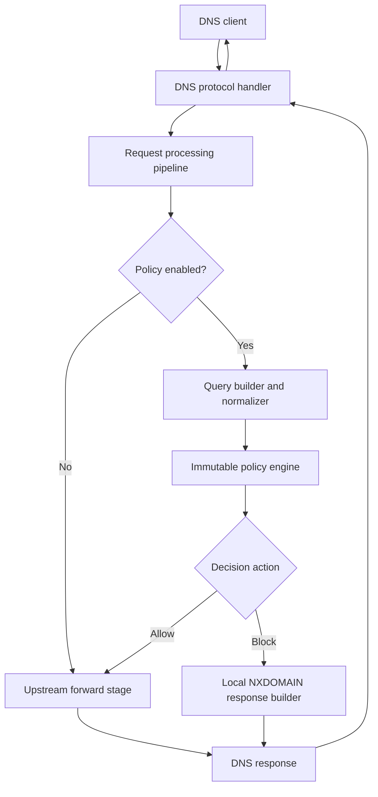
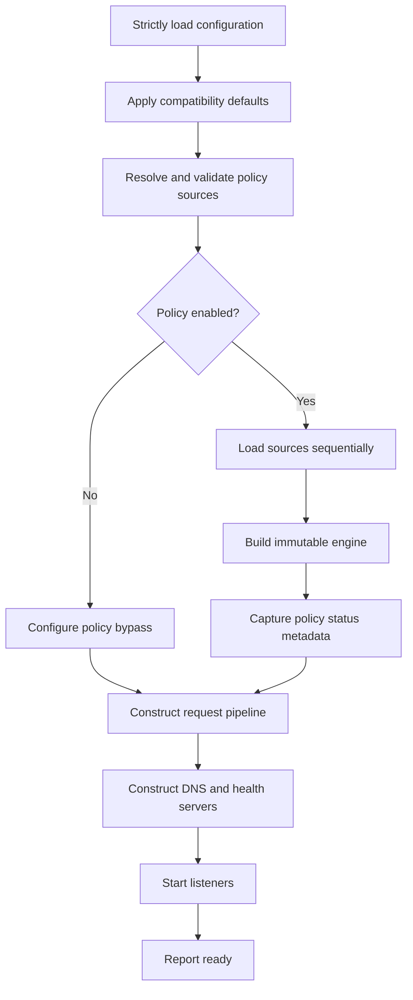
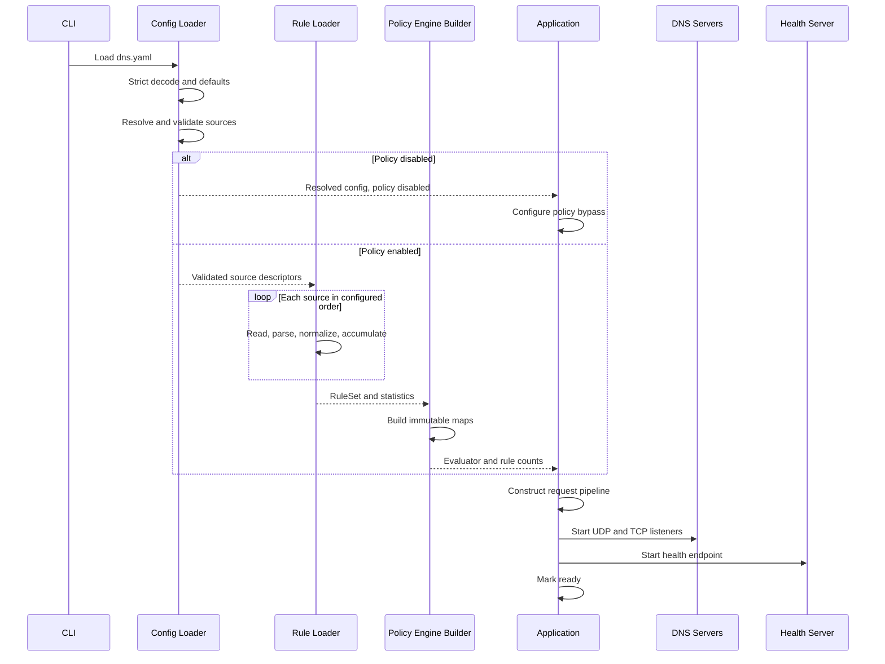
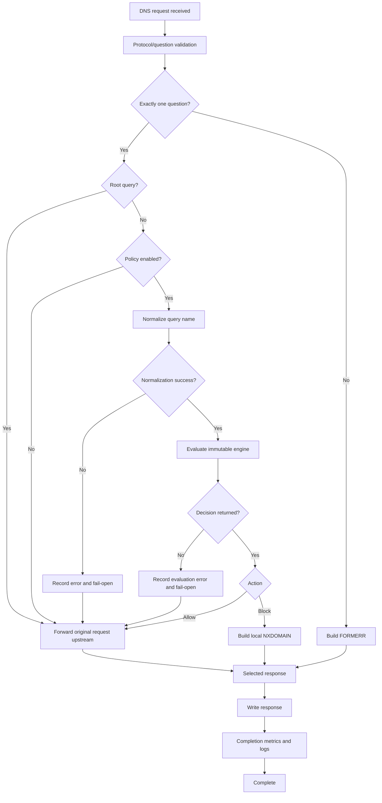
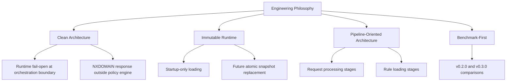

# SPRINT-03 — Policy Engine

> **Milestone:** Milestone 2 — DNS Filtering Foundation  
> **Target version:** `v0.3.0`  
> **Primary component:** Go DNS service  
> **Status:** Approved implementation specification  
> **Project:** HomeDNS Analytics  
> **Author:** Adrien Houée  
> **Last updated:** August 2026

---

## Document Control

| Field | Value |
|---|---|
| Specification owner | HomeDNS Analytics project |
| Implementation branch base | `develop` |
| Release target | `main` through `release/v0.3.0` |
| Previous production baseline | `v0.2.0` |
| Reference platform | Raspberry Pi 3 Model B, ARM64, approximately 1 GB RAM |
| Primary configuration | `/opt/homedns/shared/config/dns.yaml` |
| Policy data directory | `/opt/homedns/shared/config/policy/` |
| Normative language | “shall”, “must”, and “required” define mandatory behavior |

### Revision History

| Revision | Date | Status | Description |
|---|---|---|---|
| 0.1 | August 2026 | Approved draft | Consolidated Sprint 03 design decisions |
| 1.0 | August 2026 | Approved specification | Final normative chapters and appendices |

---

## Table of Contents

- [Engineering Philosophy](#engineering-philosophy)
- [1. Introduction](#1-introduction)
- [2. Normative Decisions](#2-normative-decisions)
- [3. Architecture](#3-architecture)
- [4. Domain Model](#4-domain-model)
- [5. Functional Specification](#5-functional-specification)
- [6. Configuration](#6-configuration)
- [7. Rule Loading](#7-rule-loading)
- [8. Matching Engine](#8-matching-engine)
- [9. Request Processing Pipeline](#9-request-processing-pipeline)
- [10. Observability](#10-observability)
- [11. Testing Strategy](#11-testing-strategy)
- [12. Benchmark Strategy](#12-benchmark-strategy)
- [13. Security, Privacy, and Operational Safety](#13-security-privacy-and-operational-safety)
- [14. Deployment and Lifecycle](#14-deployment-and-lifecycle)
- [15. Implementation Plan](#15-implementation-plan)
- [16. Acceptance Criteria](#16-acceptance-criteria)
- [17. Future Work](#17-future-work)
- [Appendix A — Complete Configuration Reference](#appendix-a--complete-configuration-reference)
- [Appendix B — Rule File Reference](#appendix-b--rule-file-reference)
- [Appendix C — Startup Sequence](#appendix-c--startup-sequence)
- [Appendix D — Request Processing Pipeline](#appendix-d--request-processing-pipeline)
- [Appendix E — Processing Context](#appendix-e--processing-context)
- [Appendix F — Rule Loading Pipeline](#appendix-f--rule-loading-pipeline)
- [Appendix G — Benchmark Profiles](#appendix-g--benchmark-profiles)
- [Appendix H — Metrics Reference](#appendix-h--metrics-reference)
- [Appendix I — Health Endpoint Reference](#appendix-i--health-endpoint-reference)
- [Appendix J — Proposed Repository and Runtime Layout](#appendix-j--proposed-repository-and-runtime-layout)
- [Appendix K — Release Checklist](#appendix-k--release-checklist)
- [Appendix L — Architecture Decision Map](#appendix-l--architecture-decision-map)
- [Appendix M — Validation Commands](#appendix-m--validation-commands)
- [Appendix N — Pull Request Sequence](#appendix-n--pull-request-sequence)

---

# Engineering Philosophy

This section defines the engineering principles that guide Sprint 03 and the long-term evolution of HomeDNS. When several implementation approaches satisfy the functional requirements, the approach most consistent with these principles should be preferred.

## Deterministic behavior

Given identical configuration and an identical DNS request, HomeDNS shall produce the same policy decision. Runtime behavior shall not depend on timing, goroutine scheduling, previous requests, randomness, or hidden mutable state.

## Immutable runtime state

Configuration and policy data are validated during startup. Runtime policy evaluation operates on one immutable snapshot. Future reload support shall replace complete snapshots rather than mutate active rule structures in place.

## Pipeline-oriented architecture

Sequential processing shall be represented as explicit, composable stages rather than large monolithic functions. This principle applies to startup, rule loading, DNS request processing, and the existing benchmark execution model.

## Single responsibility

Each component owns one primary responsibility. The normalizer normalizes names, the loader loads rules, the policy engine decides, the upstream client resolves, the metrics registry records, and the health subsystem reports.

## Composition over complexity

Small cooperating components are preferred over feature-rich objects. Abstractions must solve a current design need rather than anticipate every possible future feature.

## Explicit domain models

Business concepts shall be represented through explicit types such as `Query`, `Rule`, `Decision`, `Action`, `Reason`, `RuleSet`, and loading statistics. Primitive booleans and arbitrary strings shall not carry hidden business meaning.

## Startup validation

Errors should be found before HomeDNS becomes ready. Invalid configuration, missing configured files, unsafe file types, and an unbuildable active policy prevent startup.

## Availability with explicit boundaries

Startup favors correctness. Runtime evaluation favors availability. An explicitly enabled policy that cannot initialize fails startup; an unexpected runtime evaluation error fails open for that request and is observable through metrics and logs.

## Observability by design

Health, metrics, structured logs, and benchmark reports are first-class outputs. They remain passive and shall never change policy decisions or request behavior.

## Benchmark-driven engineering

Performance shall be measured rather than assumed. Sprint 03 must quantify the cost of normalization, matching, rule loading, local blocked responses, and the request pipeline against the official `v0.2.0` baseline.

## Testability as an architectural requirement

Components should naturally support unit tests, integration tests, fuzzing, race detection, controlled upstream validation, and target-hardware benchmarks.

## Backward compatibility

Existing `v0.2.0` configurations without a `policy` section remain valid and preserve transparent forwarding. Existing benchmark report schema semantics remain valid.

## Documentation as part of the product

Architecture, operations, user behavior, ADRs, benchmark methodology, and release procedures are part of the delivered feature. Outdated documentation is considered a defect.

## Incremental delivery

Sprint 03 shall be implemented through focused branches and pull requests. Every merged increment must compile, pass its applicable checks, and preserve a usable `develop` branch.

---

# 1. Introduction

## 1.1 Sprint objective

Sprint 03 introduces the first HomeDNS Policy Engine. It allows the Go DNS service to decide whether a DNS query is allowed or blocked before contacting the configured upstream resolver.

The sprint transforms HomeDNS from a transparent DNS forwarder into a DNS filtering service while preserving the reliability, deployment, health, metrics, and benchmark foundations delivered in Sprint 02.

The core outcome is:

```text
DNS request
    |
    v
Validate and normalize
    |
    v
Evaluate immutable policy
    |
    +-- Allow --> Forward unchanged to upstream
    |
    +-- Block --> Return local NXDOMAIN
```

## 1.2 Context

Sprint 00 established repository structure, development standards, CI foundations, documentation conventions, and the Git workflow.

Sprint 01 established the secured Raspberry Pi environment, systemd operations, deployment directories, resource baselines, and production access procedures.

Sprint 02 delivered:

- one Go DNS service binary;
- UDP and TCP forwarding;
- one configured upstream resolver;
- structured logging;
- health and runtime metrics;
- graceful shutdown;
- ARM64 packaging and deployment;
- automatic binary rollback;
- benchmark profiles and Schema v2 reports;
- process, system, and thermal resource collection;
- the official `v0.2.0` forwarding baseline.

Sprint 03 builds on those foundations instead of redesigning them.

## 1.3 Roadmap refinement

The original roadmap grouped filtering, downloaded lists, runtime reload, and configurable block responses in one sprint. The approved Sprint 03 scope deliberately separates policy evaluation from rule management.

Sprint 03 includes:

- local static whitelist, user blacklist, and blocklist files;
- startup-only loading;
- immutable in-memory matching;
- fixed NXDOMAIN blocking;
- rich decisions and aggregate observability.

The following roadmap items are deferred to later work:

- downloading external lists;
- scheduling updates;
- runtime reload;
- persistence and SQLite;
- configurable block responses;
- management APIs and dashboard workflows.

This refinement keeps Sprint 03 cohesive: it answers whether a query should be forwarded, not how policy sources are downloaded, stored, edited, or refreshed.

## 1.4 Sprint goal

At the end of Sprint 03, an operator shall be able to:

1. create local whitelist, blacklist, and blocklist files;
2. enable policy in `dns.yaml`;
3. restart or deploy HomeDNS;
4. confirm the loaded policy through `/health`;
5. receive a normal upstream answer for an allowed domain;
6. receive a local NXDOMAIN response for a blocked domain;
7. verify that a whitelist overrides every blocking source;
8. inspect aggregate policy metrics;
9. run policy loading and runtime benchmarks;
10. compare `v0.3.0` with the official `v0.2.0` baseline;
11. disable policy and recover forwarding-only behavior.

## 1.5 Included scope

Sprint 03 includes:

- a HomeDNS-owned policy query model;
- a dedicated domain normalizer;
- strict rule-domain validation;
- whitelist, user blacklist, and static blocklist categories;
- domain-and-subtree matching;
- deterministic precedence;
- most-specific matching within a category;
- immutable rule collections and engine;
- static file loading during startup;
- domain-only and simple hosts-file parsing;
- rich decisions with action, reason, source, and matched rule;
- staged request processing;
- local NXDOMAIN responses;
- runtime fail-open behavior for evaluation errors;
- policy health metadata and aggregate metrics;
- deterministic policy benchmark fixtures and profiles;
- unit, integration, fuzz, race, protocol, and Pi validation;
- operations, architecture, ADR, user, and sprint documentation.

## 1.6 Explicitly excluded

Sprint 03 does not include:

- automatic blocklist downloads;
- scheduled updates;
- runtime reload or SIGHUP reload;
- mutable policy maps;
- SQLite or another policy database;
- query-history persistence;
- a REST policy API;
- dashboard policy editing;
- client-specific rules;
- time-based rules;
- categories;
- regular expressions;
- wildcard syntax;
- exact-only rule syntax;
- Public Suffix List validation;
- Unicode-to-IDNA conversion;
- sinkhole A or AAAA responses;
- configurable `REFUSED` or `NODATA` modes;
- synthetic SOA records or HomeDNS-defined negative TTL;
- DNS cache;
- DoH or DoT;
- per-domain, per-source, or per-client metric labels.

## 1.7 Success principles

Sprint 03 is successful when filtering is correct, observable, concurrency-safe, measurable, deployable, and small enough to understand. A feature that blocks domains but cannot explain, test, benchmark, deploy, or safely disable itself is not considered complete.

---

# 2. Normative Decisions

Unless this specification is formally revised, the statements in this chapter are mandatory.

## 2.1 General

1. Policy filtering is optional.
2. Absence of the `policy` section means policy is disabled.
3. Policy evaluation is deterministic.
4. The active policy is immutable after startup.
5. Runtime evaluation performs no filesystem or network I/O.
6. Policy-disabled mode uses the same request pipeline while bypassing policy stages.
7. The existing benchmark architecture is extended, not broadly refactored.

## 2.2 Request input and validation

8. The policy package owns a small `Query` model containing canonical name, DNS type, and class.
9. The policy package does not receive `miekg/dns.Msg`.
10. Exactly one DNS question is supported.
11. Zero-question and multi-question requests return `FORMERR` through the existing invalid-request path.
12. A valid root query bypasses policy and is forwarded normally.
13. Single-label queries are valid for forwarding but cannot be configured as rules.
14. Policy applies to every DNS query type by domain name.

## 2.3 Normalization

15. Query and rule normalization share one internal implementation and expose separate intent-specific APIs.
16. Canonical domains are lowercase and contain no trailing dot.
17. Zero or one trailing dot is accepted; repeated trailing dots are rejected.
18. Surrounding ASCII whitespace is trimmed; embedded whitespace is rejected.
19. Empty labels are rejected.
20. ASCII letters, digits, hyphens, and underscores are supported.
21. Labels are limited to 63 bytes and canonical names to 253 bytes.
22. Escaped presentation names and Unicode input are unsupported in Sprint 03.
23. Rule domains require at least two labels.
24. Root is rejected as a policy domain.
25. Normalization errors use a structured `DomainError` and typed kind.

## 2.4 Rule categories and precedence

26. Supported categories are whitelist, user blacklist, and static blocklists.
27. Precedence is whitelist, user blacklist, static blocklists, then default allow.
28. Whitelist always overrides every blocking category.
29. User blacklist has precedence over static blocklists.
30. Rules match their domain and all descendants.
31. The most-specific matching rule wins within a category.
32. Flat immutable maps with label-aware suffix lookup are the initial storage strategy.
33. The public behavior must not depend on the concrete storage implementation.
34. Every stored rule contains canonical domain and source name.
35. Source semantics come from the containing category, not duplicated action fields on every rule.

## 2.5 Decisions and errors

36. The engine returns a rich `Decision` containing action, reason, source, and matched rule.
37. Default allow has no source or matched rule.
38. The engine owns precedence and decision construction.
39. The DNS layer does not recreate policy logic.
40. Runtime returned evaluation errors fail open in the request pipeline.
41. Initialization errors fail startup.
42. Panics are handled only at the existing request boundary and do not trigger speculative fail-open continuation.

## 2.6 Static file loading

43. Policy is loaded once during application construction before listeners start.
44. One optional whitelist file is supported.
45. One optional user blacklist file is supported.
46. Multiple ordered static blocklist files are supported.
47. Relative paths are resolved relative to the directory containing `dns.yaml`.
48. Configured missing, unreadable, or non-regular files are fatal.
49. Omitted paths mean an intentionally empty category.
50. Empty whitelist and user blacklist files are valid.
51. An empty static blocklist produces a warning.
52. An enabled policy with zero accepted rules overall is fatal.
53. Domain-only lines and recognized sinkhole hosts lines are supported.
54. Recognized hosts addresses are `0.0.0.0`, `127.0.0.1`, `::`, and `::1`.
55. A hosts line must contain exactly one domain after the optional address.
56. Blank lines, full-line `#` comments, and trailing `#` comments are supported.
57. First occurrence wins for duplicates within a category.
58. Configured blocklist order determines which source is retained for cross-file duplicates.
59. Overlapping domains across categories are retained because precedence requires them.
60. Source names in decisions use base filenames.
61. Duplicate source basenames are rejected.
62. Malformed entries are skipped with bounded warnings and complete statistics.
63. At most the first 20 malformed-line details per source are logged; the remainder are summarized.
64. A configured non-empty source that produces zero valid rules is fatal.
65. Loading is sequential and bounded by tested safety constants.
66. Exact safety limits are finalized after the early Raspberry Pi memory prototype.

## 2.7 Block behavior

67. Blocked requests never contact upstream.
68. Sprint 03 returns local `NXDOMAIN` for all query types.
69. Blocking mode is not configurable in Sprint 03.
70. `REFUSED`, `NODATA`, and sinkhole modes are deferred.
71. Responses are constructed with the DNS library reply helper.
72. Block responses contain no answer and no synthetic SOA.
73. HomeDNS defines no negative TTL in Sprint 03.
74. No policy metadata is included in DNS responses.
75. A failed local response write is recorded and never followed by upstream forwarding.

## 2.8 Observability and privacy

76. The existing metrics component is extended.
77. Metrics are recorded by the request pipeline, not the pure policy engine.
78. Fail-open requests have a dedicated counter and are not normal allows.
79. Reason counters remain low-cardinality.
80. No permanent per-domain, per-source, or per-client metric labels are allowed.
81. `responses_local_policy` counts successfully written local policy responses.
82. Health exposes policy enabled state, readiness, fixed blocking mode, source count, rule counts, and aggregate runtime metrics.
83. Health does not expose filesystem paths or file-level loader details.
84. Health remains bound to localhost.
85. Blocked domains may appear only in DEBUG logs.
86. Allowed domains are never logged individually.
87. Repetitive runtime errors are rate-limited or suppressed while counters continue increasing.

## 2.9 Benchmarking and quality

88. Existing `quick`, `validation`, and `endurance` profiles keep their existing meaning.
89. Dedicated policy loading and runtime profiles are added.
90. Policy traffic includes allowed, blocked, and mixed scenarios.
91. The mixed workload is 80% default allow, 10% static blocklist, 5% user blacklist, and 5% whitelist.
92. Deterministic synthetic fixtures are used.
93. Standard rule scales are 1,000, 10,000, 100,000, and 500,000 rules.
94. A 1,000,000-rule load is an optional prototype stress point, not a mandatory release profile.
95. Benchmark correctness is required before performance results are accepted.
96. Blocked upstream exchanges must equal zero.
97. Schema v2 remains valid through optional backward-compatible additions.
98. Functional and smoke benchmark checks run in CI; full performance runs execute on the Raspberry Pi.
99. Release performance gates are relative and safety-based, with exact thresholds finalized from prototype measurements.

## 2.10 Delivery

100. Sprint 03 is delivered through focused branches and pull requests.
101. Domain model and normalization precede loading and matching.
102. Rule loading and the engine precede DNS integration.
103. The request processing refactor is behavior-preserving and lands before policy integration.
104. Documentation is delivered with the implementation and completed before `v0.3.0`.
105. Downloading, reload, persistence, cache, and query history remain out of scope.

---

# 3. Architecture

## 3.1 Architectural objective

Sprint 03 adds policy evaluation without turning the DNS handler into a large orchestration object. DNS protocol handling, policy decisions, upstream resolution, response construction, metrics, health, and file loading remain separated.

## 3.2 High-level request architecture



One runtime pipeline exists. Policy-disabled mode bypasses the policy stages but does not restore a second legacy handler-to-upstream path.

## 3.3 Logical layers

```text
Protocol layer
    DNS parsing, question-count validation, wire response writing

Processing layer
    Request-scoped pipeline orchestration and stage transitions

Policy layer
    Query model, normalization, rule loading, matching, decisions

Infrastructure layer
    Filesystem access during startup and upstream DNS exchange at runtime

Observability layer
    Metrics snapshots, health serialization, structured logs, benchmarks
```

## 3.4 Proposed package ownership

The exact files may evolve during implementation, but responsibilities shall remain clear.

```text
dns/internal/
├── app/
│   ├── application construction
│   ├── lifecycle orchestration
│   └── dependency wiring
├── config/
│   ├── strict YAML decoding
│   ├── defaults
│   ├── path resolution
│   └── cross-field validation
├── dnsserver/
│   ├── UDP/TCP protocol adapters
│   ├── question-count validation
│   ├── response writing
│   └── request-boundary panic recovery
├── pipeline/
│   ├── processor/orchestrator
│   ├── request-scoped processing context
│   ├── validation stage
│   ├── query stage
│   ├── policy stage
│   ├── resolution stage
│   ├── response stage
│   └── completion/observability stage
├── policy/
│   ├── domain model
│   ├── normalizer
│   ├── rule parser
│   ├── loader
│   ├── lookup planner
│   ├── category matcher
│   ├── decision builder
│   └── immutable engine
├── upstream/
│   └── upstream forwarding only
├── metrics/
│   └── existing registry extended with policy fields
├── health/
│   └── existing health contract extended with policy snapshot
├── benchmark/
│   ├── existing scenario, runner, collector, analyzer, and report architecture
│   └── policy fixtures and profiles
└── testutil/
    ├── controlled DNS upstream
    └── request-pipeline test harness
```

Package names may be adjusted to fit the existing repository conventions. The specification requires the boundaries, not a forced proliferation of packages.

## 3.5 Dependency direction

The intended dependency direction is:

```text
dnsserver -> pipeline interfaces
pipeline  -> policy evaluator, upstream forwarder, response builder, metrics recorder
policy    -> policy-owned values only
upstream  -> DNS transport library
health    -> immutable status and metrics snapshots
app       -> concrete construction and lifecycle
```

The policy package shall not depend on:

- `dnsserver`;
- `upstream`;
- `health`;
- the metrics registry;
- the logger;
- YAML;
- the application lifecycle.

## 3.6 Pipeline-oriented subsystems

Sprint 03 formalizes three sequential processing models:

### Startup pipeline

```text
parse configuration
-> apply defaults
-> resolve and validate paths
-> load sources
-> construct immutable engine
-> construct request pipeline
-> start listeners
-> ready
```

### Rule-loading pipeline

```text
source reader
-> line parser
-> domain normalizer
-> rule validator
-> category accumulator
-> snapshot/engine builder
```

### Request pipeline

```text
protocol validation
-> query construction
-> policy evaluation or bypass
-> local block or upstream resolution
-> response construction
-> response write
-> completion metrics and logging
```

The existing benchmark subsystem already has equivalent scenario, execution, collection, analysis, and reporting responsibilities and shall be extended rather than rewritten.

## 3.7 Processing context architecture

The request pipeline uses one request-scoped processing context. It is never shared between requests or goroutines.

The original design preference for immutable outputs remains: stages shall not freely mutate shared global state. A stage receives a context snapshot and returns an updated context or typed result. Implementations may use controlled request-local mutation for efficiency, provided:

- ownership remains with the current request;
- only the orchestrator advances pipeline state;
- completed values are not modified by later stages except through explicit fields;
- no stage reaches into another stage’s private state;
- tests can assert state transitions deterministically.

This reconciles pipeline composability with Raspberry Pi allocation sensitivity.

## 3.8 Policy engine composition

The policy engine is not a monolithic matcher. Its conceptual collaborators are:

```text
normalized query
    |
    v
lookup planner
    |
    v
ordered candidate suffixes
    |
    v
category matchers
    |
    v
decision builder
    |
    v
rich decision
```

The concrete implementation may combine very small collaborators when separate types would add ceremony without value. The responsibilities must remain independently testable.

## 3.9 Health architecture

Policy startup metadata is immutable in Sprint 03. The application captures:

- enabled state;
- readiness;
- blocking mode;
- source count;
- rule counts.

The health handler combines this metadata with the existing runtime metrics snapshot. It does not inspect policy maps or loader internals.

## 3.10 Runtime concurrency

One immutable engine is shared by concurrent UDP and TCP handlers. Evaluation performs read-only map lookups and string slicing. No policy mutex, write lock, channel, or atomic write is required.

The metrics registry may continue using its existing synchronization model. Observability synchronization must not leak into the policy engine.

## 3.11 Architectural invariants

- One request pipeline processes all DNS traffic.
- Policy evaluation occurs at most once per policy-eligible request.
- One immutable policy engine is active during Sprint 03.
- Rule loading completes before listeners start.
- Runtime policy evaluation performs no I/O.
- The upstream component does not know why a query was allowed.
- The DNS handler does not implement precedence or matching.
- Observability cannot alter decisions.
- Future runtime reload replaces the whole engine snapshot.

---

# 4. Domain Model

## 4.1 Design principles

The policy domain model is protocol-independent, immutable after construction, explicit, and small. It represents business concepts rather than filesystem, YAML, HTTP, or DNS-library implementation details.

## 4.2 Query

A `Query` contains the policy-relevant data extracted from one DNS question:

```text
Name  canonical domain string
Type  DNS record type
Class DNS class
```

The initial model intentionally excludes:

- the original mixed-case/FQDN presentation name;
- client IP address;
- UDP or TCP transport;
- message ID;
- EDNS records;
- timestamps.

The DNS handler and processing context retain protocol information when needed for response construction or structured diagnostics.

### Query invariants

- `Name` is canonical.
- `Name` is non-empty except that root is intercepted before query construction.
- `Name` has zero or more dots; single-label query names are permitted.
- `Type` and `Class` preserve the DNS question values.
- Policy decisions are currently independent of type and class, but the fields preserve future compatibility.

## 4.3 Rule

A `Rule` contains:

```text
Domain canonical rule domain
Source stable source basename
```

Action and reason are not repeated on every rule. The containing collection determines the semantics:

- whitelist collection -> allow by whitelist;
- user blacklist collection -> block by user blacklist;
- static blocklist collection -> block by static blocklist.

This avoids duplicated metadata across hundreds of thousands of entries and prevents invalid action/reason combinations.

## 4.4 RuleSet

The loader produces an immutable logical `RuleSet`:

```text
Whitelist
UserBlacklist
Blocklists
```

Each collection retains enough source metadata to create a rich decision. The engine constructor may transform the logical `RuleSet` into optimized maps.

## 4.5 Action

Sprint 03 supports:

```text
Allow
Block
```

No redirect, rewrite, rate-limit, log-only, or alternate DNS response action exists.

## 4.6 Reason

Sprint 03 supports:

```text
DefaultAllow
WhitelistMatch
UserBlacklistMatch
StaticBlocklistMatch
```

Reason values are stable low-cardinality categories suitable for aggregate metrics.

## 4.7 Decision

A `Decision` contains:

```text
Action
Reason
Source
Rule
```

Examples:

```text
Allow / DefaultAllow / no source / no rule
Allow / WhitelistMatch / whitelist.txt / safe.example.com
Block / UserBlacklistMatch / blacklist.txt / telemetry.example.com
Block / StaticBlocklistMatch / ads.txt / ads.example.com
```

Construction helpers shall enforce valid combinations. Arbitrary struct literals throughout the codebase are discouraged.

## 4.8 Decision invariants

Valid combinations include:

- Allow + DefaultAllow + empty source/rule;
- Allow + WhitelistMatch + non-empty source/rule;
- Block + UserBlacklistMatch + non-empty source/rule;
- Block + StaticBlocklistMatch + non-empty source/rule.

Invalid combinations include:

- Block + DefaultAllow;
- Allow + StaticBlocklistMatch;
- match reason without source or rule;
- default allow with source metadata.

## 4.9 DomainError

Normalization failures use a structured error:

```text
DomainError
    Kind
    Value or bounded context
    Label index when applicable
```

Expected kinds include:

- empty domain;
- root domain;
- single-label rule;
- invalid character;
- embedded whitespace;
- empty label;
- label too long;
- domain too long;
- repeated trailing dot;
- unsupported escape;
- unsupported Unicode/non-ASCII input.

The exact exported names may follow Go conventions, but callers shall use typed classification rather than parse strings.

## 4.10 Loading statistics

The loader returns immutable file and total statistics.

Per source:

- source basename;
- category;
- lines read;
- accepted rules;
- duplicates;
- invalid lines;
- blank lines;
- comments;
- suppressed warning count;
- load duration.

Totals:

- files loaded;
- accepted rules by category;
- total accepted rules;
- duplicates;
- invalid lines;
- source count;
- total loading duration.

Runtime hit counters do not belong to these objects.

## 4.11 Engine statistics

The engine exposes immutable counts:

```text
WhitelistRules
UserBlacklistRules
BlocklistRules
TotalRules
SourceCount
```

The health subsystem consumes these counts without accessing the match maps.

## 4.12 Policy status metadata

Application construction creates immutable policy status metadata:

```text
Enabled
Ready
BlockingMode = nxdomain
SourceCount
RuleCounts
```

Dynamic process-lifetime policy metrics remain in the existing metrics registry.

## 4.13 Domain model invariants

- Every stored query and rule name is canonical.
- Every rule belongs to exactly one semantic category and one source.
- Every successful evaluation produces exactly one valid decision.
- Default allow has no matched rule.
- Matching decisions contain source and matched rule.
- Domain values do not depend on `miekg/dns`, YAML, HTTP, or filesystem types.
- Runtime metrics do not mutate or decorate domain values.

# 5. Functional Specification

## 5.1 Functional objective

For every supported DNS request, HomeDNS determines one of three processing outcomes:

```text
normal allow
explicit block
runtime fail-open
```

Normal allow and fail-open contact the configured upstream resolver. Explicit block produces a local NXDOMAIN and never contacts upstream.

## 5.2 Request eligibility

Policy evaluation begins only after the DNS protocol layer has confirmed exactly one question.

| Request shape | Behavior |
|---|---|
| Zero questions | Return `FORMERR`; do not invoke policy |
| One ordinary question | Continue to policy when enabled |
| Multiple questions | Return `FORMERR`; do not invoke policy |
| Malformed DNS message | Use existing invalid-request handling |
| Root question `.` | Bypass policy and forward |

Invalid-question requests increment existing invalid-request and response-code metrics only. They do not increment policy metrics.

## 5.3 Policy-disabled behavior

When the `policy` section is absent or `policy.enabled` is false:

- policy files are not opened or validated;
- query normalization for policy is skipped;
- no policy decision or policy metric is produced;
- the request pipeline forwards the original DNS request using the Sprint 02 upstream behavior;
- health reports policy disabled and ready with zero active rules.

The request still flows through the shared pipeline so future stages do not need two implementations.

## 5.4 Policy-enabled behavior

For a normal one-question request:

1. extract the DNS question;
2. normalize the question name using query rules;
3. construct the HomeDNS `Query`;
4. evaluate the immutable engine once;
5. interpret the returned decision;
6. resolve upstream or build a local response;
7. write the response;
8. record completion metrics and structured diagnostics.

## 5.5 Policy evaluation order

```text
1. Whitelist
2. User blacklist
3. Static blocklists
4. Default allow
```

The first matching category terminates evaluation. Within a category, candidate domains are tested from most specific to broadest.

## 5.6 Rule semantics

A configured rule `example.com` matches:

```text
example.com
www.example.com
mail.eu.example.com
```

It does not match:

```text
myexample.com
example.org
```

Every category uses identical subtree semantics. Exact-only syntax is not available.

## 5.7 Whitelist behavior

Whitelist is evaluated first and allows the matching domain subtree even when the same or a broader domain exists in either blocking category.

Example:

```text
whitelist: safe.ads.example.com
blocklist: example.com
query: cdn.safe.ads.example.com
result: Allow / WhitelistMatch / safe.ads.example.com
```

## 5.8 User blacklist behavior

A user blacklist match blocks before static blocklists are inspected. If both the user blacklist and a static source match, the decision reason and source come from the user blacklist.

## 5.9 Static blocklist behavior

All configured blocklist files form one semantic category while preserving source attribution. Configured file order resolves duplicate source retention, but most-specific domain matching determines the selected rule.

Example:

```text
ads.txt: example.com
tracking.txt: ads.example.com
query: pixel.ads.example.com
result: Block / StaticBlocklistMatch / tracking.txt / ads.example.com
```

## 5.10 Default allow

When no category matches, the engine returns `Allow / DefaultAllow` with empty source and matched rule.

## 5.11 Query-type independence

Domain policy applies to every DNS record type, including `A`, `AAAA`, `CNAME`, `MX`, `TXT`, `SRV`, `HTTPS`, and otherwise valid type codes. A blocked domain returns the same NXDOMAIN behavior for every type.

## 5.12 Normal runtime allow path

An allow decision:

- increments the normal allow counter;
- increments either default-allow or whitelist reason counter;
- forwards the original `dns.Msg` unchanged to upstream;
- preserves the existing upstream timeout and error behavior;
- returns the upstream response to the client.

The normalized policy query is not substituted into the forwarded wire request.

## 5.13 Block path

A block decision:

- increments blocked and reason counters;
- records the policy stage duration;
- builds a local response using the DNS library reply helper;
- sets `NXDOMAIN`;
- preserves transaction ID and question;
- preserves resolver-consistent request flags;
- contains no answer records;
- contains no synthetic authority SOA;
- does not contact upstream;
- increments `responses_nxdomain` after response classification;
- increments `responses_local_policy` only after a successful response write.

## 5.14 Runtime fail-open path

A returned normalization or evaluation error that prevents a trustworthy decision:

- increments the appropriate policy error counter;
- increments `policy_requests_fail_open`;
- emits bounded structured diagnostics;
- forwards the original request upstream;
- does not increment normal allow or decision-reason counters.

Fail-open is not used for:

- malformed DNS requests;
- explicit block decisions;
- initialization failures;
- request-boundary panics.

## 5.15 Root and policy-unsupported names

A valid root query is an expected policy bypass, not a fail-open error. It produces no policy counters.

A valid but policy-unsupported presentation name may fail open when the DNS library parsed the request but the Sprint 03 normalizer cannot represent it. Typed errors distinguish this case from structurally invalid DNS input.

## 5.16 Response-write failure

If writing a local policy response fails:

- increment existing `response_write_errors`;
- do not increment `responses_local_policy`;
- log the failure without exposing the domain above DEBUG;
- return the write error to the request boundary;
- do not contact upstream after the explicit block decision.

## 5.17 EDNS and flags

Blocked responses must remain valid for clients using EDNS and DNSSEC-OK. Implementation shall verify the concrete behavior of the chosen `miekg/dns` reply helper and shall not blindly echo arbitrary additional records.

The response shall:

- set QR as a reply;
- preserve request ID and question;
- preserve RD where appropriate;
- report RA consistently with normal HomeDNS resolver behavior;
- not set AA;
- not set TC unless the DNS library requires it for a valid encoded response.

## 5.18 Functional invariants

- A policy-eligible query produces exactly one of allow, block, or fail-open.
- Blocked requests never reach upstream.
- Allowed and fail-open requests use the original message for upstream exchange.
- Whitelist always wins.
- Runtime evaluation happens at most once.
- Policy-disabled mode does not record policy outcomes.
- Root bypass is not an error.
- Policy metrics and logs never influence request behavior.

---

# 6. Configuration

## 6.1 Configuration objectives

The policy configuration must be explicit when enabled, safe by default, strict against typographical errors, and compatible with the existing `v0.2.0` configuration when the section is absent.

## 6.2 YAML shape

Sprint 03 adds one optional top-level section:

```yaml
policy:
  enabled: true
  whitelist_file: "policy/whitelist.txt"
  user_blacklist_file: "policy/blacklist.txt"
  blocklist_files:
    - "policy/blocklists/ads.txt"
    - "policy/blocklists/malware.txt"
```

The approved model is intentionally asymmetric:

- zero or one whitelist file;
- zero or one user blacklist file;
- zero or more static blocklist files.

Generic source objects, configured priorities, inline rules, and format selectors are deferred.

## 6.3 Backward-compatible defaults

A missing `policy` section is equivalent to:

```yaml
policy:
  enabled: false
```

This allows the current production configuration to start with the `v0.3.0` binary without modification.

If policy is disabled:

- source fields may be absent;
- configured source paths, if present, are not opened or validated;
- health reports zero rules and ready policy bypass;
- forwarding behavior remains operational.

## 6.4 Enabled validation

When `enabled: true`:

- at least one source path must be configured;
- all configured paths must resolve successfully;
- each configured file must exist, be readable, and resolve to a regular file;
- duplicate resolved paths are invalid;
- path reuse across categories is invalid;
- duplicate static blocklist basenames are invalid;
- loading must produce at least one valid rule overall.

## 6.5 Strict decoding

YAML decoding shall reject unknown fields across the full configuration document when compatible with the current configuration model and tests.

Examples that must fail:

```yaml
policy:
  enable: true
```

```yaml
policy:
  enabled: true
  cache: true
```

Strict decoding must be validated against every existing configuration example before merge.

## 6.6 Path resolution

Relative policy paths are resolved relative to the directory containing the selected YAML file, never the process working directory.

Example:

```text
configuration: /opt/homedns/shared/config/dns.yaml
configured:    policy/blocklists/ads.txt
resolved:      /opt/homedns/shared/config/policy/blocklists/ads.txt
```

Absolute paths are accepted. The resolved application configuration contains normalized absolute paths before rule loading begins.

## 6.7 Symlinks and file types

Symlinks are followed, and the final target must be a regular file. The following are rejected:

- directories;
- FIFOs;
- sockets;
- character or block devices;
- broken links;
- symlink loops.

Sprint 03 does not require the final target to remain under the configuration directory. Policy paths are administrator-controlled.

## 6.8 File extensions

No extension is required. `.txt`, `.hosts`, extensionless files, and other regular filenames are accepted when their content matches the supported parser.

## 6.9 Duplicate validation

After resolution, the same final path cannot be:

- listed twice in static blocklists;
- used as both whitelist and blocklist;
- used as both user blacklist and blocklist;
- used as whitelist and user blacklist.

Static blocklist paths with distinct directories but identical basenames are also rejected because decision source attribution uses the basename.

## 6.10 Safety limits

Loading limits are internal tested constants in Sprint 03, not YAML settings. Required limit categories are:

- maximum input line length;
- maximum source file size;
- maximum accepted rules per source;
- maximum accepted rules overall.

The exact numeric constants are finalized after the early Raspberry Pi loading prototype and documented before policy integration is complete.

Tests shall inject lower limits without modifying production YAML.

## 6.11 Configuration validation phases

```text
read YAML bytes
-> strict decode
-> apply backward-compatible defaults
-> structural validation
-> resolve paths
-> evaluate symlinks and file types
-> cross-field duplicate validation
-> return immutable resolved configuration
```

Rule content parsing is not part of configuration validation.

## 6.12 Permissions

Production guidance is:

```text
directories: root:homedns 0750
files:       root:homedns 0640
```

The service requires read access only. World-writable policy files generate warnings but are not fatal in Sprint 03. Unreadable files are fatal.

## 6.13 Example configuration behavior

| Configuration | Result |
|---|---|
| No `policy` section | Valid; policy disabled |
| `enabled: false` with no paths | Valid |
| `enabled: false` with missing paths | Valid; paths ignored |
| `enabled: true` with no paths | Invalid |
| Configured missing file | Invalid |
| Configured empty whitelist plus valid blocklist | Valid |
| All configured sources yield zero rules | Invalid |
| Unknown field | Invalid |

## 6.14 Rollback compatibility constraint

The `v0.3.0` binary accepts the old configuration. The reverse direction is not assumed.

Before enabling policy in the shared production YAML, the project must test whether the deployed `v0.2.0` binary accepts an unknown `policy` section. If it does not, rolling the binary back to `v0.2.0` may also require restoring a pre-policy configuration backup manually.

The Sprint 02 deployment system rolls back binaries, not operator-managed configuration. This limitation must be documented in upgrading and rollback procedures.

## 6.15 Configuration invariants

- Configuration is immutable after loading.
- Missing policy configuration disables filtering.
- Enabled policy is explicit and effective.
- Resolved paths are absolute.
- The rule loader receives only validated source descriptors.
- No inline policy content exists in YAML.
- Blocking mode is fixed and therefore absent from YAML.

---

# 7. Rule Loading

## 7.1 Objective

The rule-loading subsystem transforms validated source files into immutable semantic collections and complete loading statistics before DNS listeners start.

It performs filesystem I/O only during application construction.

## 7.2 Loading pipeline


The subsystem should use small focused functions or collaborators, but it must avoid artificial interface proliferation. The pipeline responsibilities are normative; the number of Go types is not.

## 7.3 Source categories

The loader receives:

- optional whitelist source;
- optional user blacklist source;
- ordered static blocklist sources.

Each source descriptor contains:

- semantic category;
- resolved path;
- stable source basename;
- configured order within the category.

## 7.4 Sequential loading

Sources are processed sequentially. Reasons:

- deterministic first-source retention;
- lower peak memory;
- simpler statistics and error attribution;
- SD-card reads are likely I/O-bound;
- loading occurs once at startup.

Parallel loading is deferred until measurements demonstrate a need.

## 7.5 Supported lines

### Domain-only

```text
example.com
Example.COM.
_dmarc.example.com
```

### Recognized hosts-style entry

```text
0.0.0.0 ads.example.com
127.0.0.1 tracker.example.com
:: ipv6-ads.example.com
::1 local-sink.example.com
```

Only recognized sinkhole addresses activate hosts parsing. Arbitrary IP mappings are rejected because HomeDNS discards the IP and would otherwise reinterpret a normal hosts file as a blocklist.

### Blank and comments

```text

# full-line comment
example.com # trailing explanation
```

Leading and trailing ASCII whitespace are ignored. A trailing comment begins at a separated `#` segment. The parser shall not invent semicolon or other comment syntax.

## 7.6 Hosts token count

A hosts-style line must contain exactly:

```text
recognized-address domain [optional trailing comment]
```

A line with multiple aliases is invalid and skipped rather than partially loaded.

## 7.7 Domain-only token count

After removing a supported trailing comment, a domain-only rule must contain exactly one token. Additional non-comment tokens make the line invalid.

## 7.8 Normalization contract

The loader calls `NormalizeRuleDomain` after parsing the domain token. Accepted rule output is:

- lowercase;
- no trailing dot;
- two or more labels;
- ASCII/punycode;
- labels containing supported letters, digits, hyphens, or underscores;
- label and total lengths within DNS limits.

## 7.9 Empty-file behavior

| Source | Empty physical file behavior |
|---|---|
| Whitelist | Valid; zero accepted rules |
| User blacklist | Valid; zero accepted rules |
| Static blocklist | Valid with warning |

After every source completes, an enabled policy with zero accepted rules overall is fatal.

A physically non-empty configured source that yields zero valid rules is fatal, regardless of category, because it strongly indicates an unsupported or corrupted format.

## 7.10 Malformed entries

Malformed individual lines are non-fatal when valid entries remain.

For each source, the loader:

- counts every invalid line;
- logs at most the first 20 detailed warnings;
- includes source basename, line number, error kind, and bounded preview;
- caps the preview, recommended at 128 bytes;
- reports the number of suppressed warnings;
- emits a final source summary.

The full unbounded line and full file contents are never logged.

## 7.11 Duplicates within one source

Canonical duplicates retain the first occurrence and increment duplicate count.

Example:

```text
Example.COM.
example.com
```

stores one `example.com` rule.

No normal-level warning is emitted for each duplicate. Detailed examples may be available at DEBUG, while the source summary always reports totals.

## 7.12 Duplicates across sources in one category

For static blocklists, configured source order determines which source metadata is retained for an identical canonical domain.

```yaml
blocklist_files:
  - policy/blocklists/ads.txt
  - policy/blocklists/combined.txt
```

If both contain `example.com`, the stored source is `ads.txt`.

## 7.13 Overlap across categories

Cross-category overlap is preserved:

```text
whitelist: example.com
blocklist: example.com
```

Both rules remain because runtime precedence, not loader deduplication, determines the outcome.

## 7.14 Safety bounds

The loader must reject work beyond the tested limits with contextual errors. It shall use `bufio.Scanner` or an equivalently bounded line reader configured with an explicit maximum token size.

An oversized line is a source-level fatal error because the scanner cannot safely resume and the content indicates an incompatible file.

Limits shall be checked before or during work to avoid reading an unsafe file fully into memory.

## 7.15 Loading statistics

Every source summary contains:

```text
source
category
lines_read
accepted
duplicates
invalid
blank
comments
warnings_suppressed
duration
```

A total summary contains category counts, source count, total accepted rules, duplicate and invalid totals, and total duration.

## 7.16 Loading logs

Recommended structured events:

```text
policy source loading started
policy malformed line skipped
policy source loaded
policy engine initialized
```

Per-source start and completion events provide progress without line-count log spam.

## 7.17 Concurrent source modification

Sprint 03 does not compare metadata before and after reads and does not load entire files into memory to create a byte-perfect snapshot. Operators shall stop HomeDNS and replace files atomically before restarting.

Sprint 04 rule management must implement validated atomic replacement and snapshot switching.

## 7.18 Loader errors

Fatal errors wrap operational context:

```text
load static blocklist "ads.txt": open /resolved/path/ads.txt: permission denied
policy source "ads.txt" exceeds maximum file size
policy source "ads.txt" contains a line above the supported length
policy enabled but no valid rules were loaded
```

The loader never starts listeners and never applies fail-open behavior.

## 7.19 Loader invariants

- Every accepted rule is canonical.
- No duplicate canonical key exists within one category.
- First source retention is deterministic.
- All source statistics reconcile with totals.
- The loader never modifies source files.
- Runtime never reads the files again.
- The engine is constructed only after all fatal checks pass.

---

# 8. Matching Engine

## 8.1 Objective

The matching engine evaluates a canonical query against immutable category maps and returns one valid rich decision without I/O, logging, metrics, or mutation.

## 8.2 Engine API contract

Conceptually:

```go
type Evaluator interface {
    Evaluate(Query) (Decision, error)
}
```

The concrete API may use a pointer receiver and unexported implementation, but the DNS pipeline depends only on the evaluator behavior.

The engine also exposes immutable rule statistics separately from evaluation.

## 8.3 Construction

The engine constructor receives a logical `RuleSet`, validates its invariants, and builds immutable lookup structures.

Engine construction fails for:

- noncanonical stored domains;
- invalid source metadata;
- impossible category data;
- total empty active policy when the application requested policy enabled;
- internal construction errors.

## 8.4 Lookup planner

For a canonical query name, the lookup planner generates label-boundary candidates from most specific to broadest while excluding a final single-label suffix.

Example:

```text
tracker.ads.eu.example.com
ads.eu.example.com
eu.example.com
example.com
```

It never tests:

```text
com
```

For a single-label query, no rule candidate exists and evaluation returns default allow when the query reached the engine. The application may bypass such evaluation as an optimization, but behavior must remain equivalent.

## 8.5 Allocation model

Normalization allocates at most the canonical query representation required by its transformation. Candidate suffixes should use string slicing over the canonical string rather than create copies for every candidate.

The engine shall not allocate memory proportional to the total rule count during evaluation.

## 8.6 Category matcher

A category matcher maps a candidate domain to source metadata when present. The initial implementation uses flat maps:

```text
canonical domain -> source basename
```

The matcher is read-only after construction.

## 8.7 Evaluation algorithm

```text
candidates = mostSpecificToBroadest(query.Name)

match whitelist candidates
    if found -> Allow / WhitelistMatch

match user blacklist candidates
    if found -> Block / UserBlacklistMatch

match static blocklist candidates
    if found -> Block / StaticBlocklistMatch

return Allow / DefaultAllow
```

Within each category, the first candidate hit is the most-specific rule.

## 8.8 Most-specific examples

Rules:

```text
example.com
ads.example.com
```

Query:

```text
pixel.ads.example.com
```

Matched rule:

```text
ads.example.com
```

The source metadata attached to that rule appears in the decision.

## 8.9 Precedence examples

### Whitelist override

```text
whitelist: safe.ads.example.com
blocklist: ads.example.com
query: cdn.safe.ads.example.com
result: Allow / WhitelistMatch
```

### User blacklist over static blocklist

```text
user blacklist: tracker.example.com
static blocklist: example.com
query: tracker.example.com
result: Block / UserBlacklistMatch
```

### Static blocklist

```text
static blocklist: ads.example.com
query: pixel.ads.example.com
result: Block / StaticBlocklistMatch
```

### Default allow

```text
query: allowed.example.net
result: Allow / DefaultAllow
```

## 8.10 Query type behavior

The query type and class remain available in `Query`, but Sprint 03 matching uses only `Name`. The same domain decision applies to A, AAAA, TXT, MX, SRV, HTTPS, or another valid type.

## 8.11 Input validation

The engine requires canonical input and performs lightweight invariant validation. It shall not repeat the complete transformation but should reject obvious caller defects such as:

- empty name;
- uppercase ASCII;
- trailing dot;
- empty label;
- unsupported non-ASCII representation.

This catches incorrect internal callers without paying the full normalization cost twice.

## 8.12 Concurrency

Concurrent calls share one immutable engine. The engine shall not contain lazy mutable initialization. Any precomputation occurs during construction.

Required validation includes high-concurrency deterministic evaluation under `go test -race ./...`.

## 8.13 Complexity

For `L` domain labels and category count fixed at three, lookup is bounded by a small multiple of `L` hash lookups.

The total number of rules does not change lookup depth. Memory consumption scales with loaded canonical rules and source metadata, which is measured through the loading benchmarks.

## 8.14 Future optimization

A reverse-label trie, compressed radix tree, or other matcher may replace flat maps only after the baseline shows a measurable problem. Such a change must preserve:

- normalization;
- rule semantics;
- precedence;
- most-specific matching;
- rich decisions;
- public tests;
- benchmark comparability.

## 8.15 Engine invariants

- Evaluation is deterministic and side-effect free.
- Every successful evaluation returns a valid decision.
- Match maps are immutable.
- No runtime I/O occurs.
- No metrics or logs are emitted by the engine.
- Whitelist precedence cannot be configured away.
- Lookup depth is bounded by the DNS name.

---

# 9. Request Processing Pipeline

## 9.1 Objective

The request processing pipeline becomes the only runtime orchestration path for DNS requests. It preserves the current forwarding behavior while providing explicit extension points for policy, future cache, persistence events, and other features.

## 9.2 Pipeline stages

The conceptual stages are:

```text
1. Protocol validation
2. Policy query construction or policy bypass
3. Policy evaluation
4. Resolution selection
5. DNS response construction
6. Response write
7. Completion metrics and logging
```

The implementation may combine adjacent trivial stages when separate objects would add no value. It shall not collapse the pipeline into one untestable handler function.

## 9.3 DNS handler boundary

The DNS handler remains responsible for:

- receiving a parsed `dns.Msg` through `miekg/dns`;
- identifying UDP or TCP transport for diagnostics and existing metrics;
- validating question count;
- invoking the request pipeline;
- writing the final response;
- recovering unexpected request-boundary panics.

It does not load rules, normalize rule files, evaluate precedence, or call the upstream client directly.

## 9.4 Processing context

Each request creates one request-scoped context containing only the state needed by the pipeline:

```text
original request
transport metadata
start time
validated question
canonical policy Query when applicable
Decision when applicable
selected resolution path
upstream response or local response
returned error when applicable
phase timings
completion state
```

The context contains no global mutable policy state and is never reused for another request.

## 9.5 State transition model

Stages advance the context through explicit states. Invalid transitions are defects.

Example:

```text
Received
-> Validated
-> PolicyBypassed | QueryBuilt
-> Allowed | Blocked | FailOpen
-> UpstreamResolved | LocalResponseBuilt
-> ResponseWritten | Failed
-> Completed
```

Tests shall assert that a blocked state cannot transition to upstream resolution and that a malformed request cannot transition to policy evaluation.

## 9.6 Protocol validation stage

The validation stage:

- verifies exactly one question;
- identifies root queries;
- returns or builds `FORMERR` for invalid question counts;
- does not invoke policy for malformed, zero-question, multi-question, or root-bypass paths.

Root is forwarded and records no policy outcome.

## 9.7 Query builder stage

When policy is enabled and the question is eligible, the query stage:

- reads name, type, and class from the sole question;
- calls `NormalizeQueryName`;
- constructs the policy `Query`;
- retains the original request unchanged for possible forwarding.

A returned policy normalization error enters fail-open. A structurally invalid DNS request is handled before this stage.

## 9.8 Policy stage

The policy stage:

- invokes the evaluator exactly once;
- records policy-stage timing from normalization start through decision completion;
- stores the rich decision;
- maps returned evaluation errors to fail-open;
- performs no DNS response encoding itself.

## 9.9 Resolution selection

The decision selects one resolution path:

| Outcome | Resolution path |
|---|---|
| Default allow | Upstream |
| Whitelist allow | Upstream |
| User blacklist block | Local NXDOMAIN |
| Static blocklist block | Local NXDOMAIN |
| Fail-open | Upstream |
| Policy disabled | Upstream |
| Root bypass | Upstream |

## 9.10 Upstream stage

The upstream stage receives the original DNS request and existing request context. It remains unaware of policy reasons.

Before initiating network work, it checks request cancellation. Existing timeout, upstream error mapping, response ID handling, and metrics remain valid.

## 9.11 Local response stage

The local response builder receives the original request and block decision. It:

- uses the DNS reply helper;
- sets NXDOMAIN;
- preserves the question and transaction identity;
- ensures no answer or synthetic SOA is added;
- produces valid UDP and TCP responses;
- keeps policy details out of the wire response.

## 9.12 Completion and response write

The handler writes the selected response. Completion recording happens after the write attempt so `responses_local_policy` can mean a successfully written local response.

A local write failure does not fall through to upstream.

## 9.13 Metrics stage

The pipeline records:

- DNS request start and completion latency;
- policy outcome and reason;
- policy-stage latency;
- fail-open and policy errors;
- successful local policy response writes;
- existing upstream and response-code metrics through their current owners.

Metrics are recorded once at well-defined boundaries to prevent double counting.

## 9.14 Logging stage

Structured logs consume completed request context. Normal per-request success logs are not required.

- blocked decisions: DEBUG only;
- allowed domains: never individually logged;
- expected invalid DNS requests: existing appropriate level;
- unexpected policy errors: ERROR without domain, optional DEBUG detail with domain;
- repeated errors: rate-limited or suppressed.

## 9.15 Policy-disabled path

The pipeline remains active but marks policy as bypassed. It does not construct a fake allow decision and does not increment policy counters. This provides a clean within-binary benchmark control.

## 9.16 Context cancellation

Context is checked:

- at pipeline entry;
- before upstream resolution;
- through the existing upstream client request lifetime.

The immutable map evaluator does not accept `context.Context` because its bounded synchronous work does not benefit from cancellation plumbing.

## 9.17 Panic recovery

Unexpected panics are recovered at the existing request boundary:

- increment `handler_panics`;
- emit a stack trace and current pipeline phase;
- return `SERVFAIL` when possible;
- do not attempt to continue with uncertain state.

## 9.18 Test harness

A reusable pipeline test harness shall provide:

- request builders;
- fake evaluator;
- fake upstream forwarder with call counts;
- controlled response writer outcomes;
- fake or real metrics recorder;
- captured structured log sink where needed;
- stage-state assertions;
- full-pipeline execution helpers.

This harness reduces test plumbing and becomes the extension point for future stages.

## 9.19 Future stage insertion

A future DNS cache belongs after policy allow and before upstream resolution:

```text
validation
-> query/policy
-> cache lookup
-> upstream on miss
-> cache store
-> response
```

Blocked requests do not consult or populate the upstream-response cache. Future event persistence should observe completed requests without changing the decision path.

## 9.20 Pipeline invariants

- One request has one context and one terminal completion.
- Policy evaluation occurs no more than once.
- Blocked requests cannot enter upstream resolution.
- Policy-disabled requests cannot produce policy metrics.
- Response write outcome is recorded after the attempt.
- Stage order is explicit and testable.
- Context never escapes into global mutable state.

---

# 10. Observability

## 10.1 Objective

Operators must be able to confirm whether policy is enabled, loaded, ready, correct at an aggregate level, and introducing errors or meaningful overhead without exposing browsing history.

## 10.2 Ownership

The existing metrics registry remains the single runtime metrics implementation. The request pipeline records policy fields. The health handler serializes immutable policy metadata plus a runtime metrics snapshot.

The pure policy engine owns no logger, metrics recorder, health dependency, or global registry.

## 10.3 Policy outcome counters

Sprint 03 adds:

```text
policy_requests_allowed
policy_requests_blocked
policy_requests_fail_open
policy_evaluation_errors
policy_normalization_errors
```

Definitions:

- allowed: successful default-allow or whitelist decision;
- blocked: successful user-blacklist or static-blocklist decision;
- fail-open: policy error followed by upstream forwarding;
- evaluation errors: evaluator returned an error;
- normalization errors: query normalization returned an error on a protocol-valid request.

A fail-open request increments its error counter and fail-open counter, not normal allowed.

## 10.4 Reason counters

```text
policy_default_allow_hits
policy_whitelist_hits
policy_user_blacklist_hits
policy_blocklist_hits
```

These remain stable semantic categories. No counter is created per source file or rule.

## 10.5 Local response counter

```text
responses_local_policy
```

This counts successfully written local policy responses. It does not count block decisions whose response write failed.

Existing `responses_nxdomain` also increments because the wire response code is NXDOMAIN. It continues to include genuine upstream NXDOMAIN responses.

## 10.6 Latency metrics

Sprint 03 exposes two averages:

```text
average_policy_stage_latency_ms
average_dns_request_latency_ms
```

Policy-stage latency covers normalization start through completed decision or policy error classification.

DNS request latency covers request-pipeline entry through response-write completion or terminal failure. It includes upstream latency for forwarded requests and therefore is not interpreted as policy-engine latency.

The registry stores total duration and sample count internally to calculate averages consistently with existing upstream latency behavior.

Percentiles remain in benchmark reports, not the live health JSON.

## 10.7 Metric invariants

For policy-eligible completed policy outcomes:

```text
policy_requests_allowed
+ policy_requests_blocked
+ policy_requests_fail_open
= completed policy outcomes
```

For normal allows:

```text
policy_default_allow_hits
+ policy_whitelist_hits
= policy_requests_allowed
```

For normal blocks:

```text
policy_user_blacklist_hits
+ policy_blocklist_hits
= policy_requests_blocked
```

For response writes:

```text
responses_local_policy <= policy_requests_blocked
```

The difference identifies local block responses that were not written successfully.

## 10.8 Metric lifetime

Policy runtime metrics are process-lifetime counters, matching existing metrics. Future policy reload shall not silently reset them. Snapshot-specific analytics may use a future generation ID or persistent store.

## 10.9 Health policy section

Health adds a stable policy section containing:

```text
enabled
ready
blocking_mode
source_count
rule counts
aggregate policy metrics
```

It does not include:

- resolved paths;
- source filenames;
- duplicates or malformed-line details;
- individual domains;
- client IPs;
- rule contents.

## 10.10 Policy readiness

Policy readiness is true when:

- policy is disabled and the request pipeline is configured to bypass it; or
- policy is enabled and a valid immutable engine and metadata snapshot were constructed.

An enabled policy that fails initialization prevents the application from reaching health readiness.

## 10.11 Overall health status

Sprint 03 does not implement rolling policy-error thresholds. Process-lifetime policy errors and fail-open counters are exposed, but one historical error does not permanently set overall status to degraded.

Dynamic health degradation based on recent error rate is deferred until rolling-window observability exists.

## 10.12 Startup logs

Structured startup events report:

- strict configuration validation completion and duration;
- policy enabled or disabled state;
- each source start and completion;
- source statistics;
- engine rule counts and construction duration;
- total initialization duration;
- listener startup and application readiness.

## 10.13 Runtime logs

### DEBUG

- blocked decision with domain, type, reason, source, and matched rule;
- bounded unsupported-name detail;
- optional duplicate examples during loading.

### INFO

- startup, readiness, shutdown, and release metadata;
- aggregate policy summaries.

### WARN

- empty static blocklist;
- malformed rule summaries;
- broad permissions;
- non-fatal source-quality issues.

### ERROR

- fatal startup failures;
- unexpected runtime normalization/evaluation errors without domain;
- response-write failures;
- request-boundary panics.

## 10.14 Rate limiting

Counters always record every occurrence. Repetitive runtime log events are bounded by a reusable suppression or rate-limit mechanism. The mechanism shall not retain unbounded domain keys.

## 10.15 Privacy

Permanent observability is aggregate by design. Sprint 03 does not implement query history. Detailed per-query debug logs are temporary troubleshooting output and must not be enabled casually on long-running production systems.

## 10.16 Benchmark integration

Benchmark reports may consume health before and after a run and collect process/system resources externally. Benchmark-specific latency distributions and correctness details are not duplicated in the live metrics registry.

## 10.17 Observability invariants

- Policy metrics remain low-cardinality.
- Health stays localhost-only.
- Paths and rule contents are not exposed.
- Allowed domains are not logged.
- The engine remains observability-agnostic.
- Every counter has one clear update boundary.

---

# 11. Testing Strategy

## 11.1 Objective

Testing proves policy correctness, precedence, protocol compatibility, deterministic loading, concurrency safety, backward compatibility, observability invariants, and release readiness.

Coverage percentage is informative; behavior and boundary confidence are normative.

## 11.2 Layered strategy

```text
unit tests
    domain values, normalizer, parser, lookup planner, matchers, builders

component tests
    loader, engine, pipeline stages, metrics, health

integration tests
    configuration -> loader -> engine
    DNS handler -> pipeline -> fake/controlled upstream

end-to-end target tests
    real binary on Raspberry Pi over UDP/TCP
```

## 11.3 Internal and external package tests

Use internal-package tests for private algorithms and invariants that should not be exported. Use external-package tests for public policy behavior so the package is exercised like a consumer.

Tests must not force internal maps or helper functions into the public API.

## 11.4 Normalization test matrix

Mandatory valid query cases include:

```text
Example.COM. -> example.com
example.com -> example.com
printer -> printer
_dmarc.Example.COM. -> _dmarc.example.com
_sip._tcp.example.com -> _sip._tcp.example.com
xn--mnchen-3ya.example -> xn--mnchen-3ya.example
```

Mandatory rule distinctions include:

```text
printer -> invalid rule, valid query
. -> policy-invalid/root bypass at request layer
```

Mandatory invalid cases include:

- empty input;
- root as rule;
- repeated trailing dots;
- leading dot;
- empty interior label;
- embedded whitespace;
- unsupported characters;
- escaped presentation name;
- raw Unicode;
- label over 63 bytes;
- canonical domain over 253 bytes;
- single-label rule;
- invalid hyphen placement according to the final validator contract.

Tests are table-driven and assert structured error kinds.

## 11.5 Fuzzing

Add fuzz targets for query normalization, rule normalization, and line parsing.

Properties include:

- no panic for arbitrary bytes;
- successful normalization is idempotent;
- successful output is lowercase ASCII;
- successful output has no trailing dot;
- successful rule output contains at least two labels;
- repeated normalization returns the same result;
- parser output either normalizes successfully or returns a typed error.

Normal CI executes the seed corpus through `go test`. Extended timed fuzz campaigns run manually or in an optional workflow before release, and discovered regressions are committed as seeds.

## 11.6 Decision tests

Every successful engine test asserts:

- action;
- reason;
- source;
- matched rule.

Mandatory scenarios include exact and subtree matching, most-specific matching, every precedence combination, default allow, all query types, and deterministic duplicate-source retention.

## 11.7 Loader test matrix

Mandatory cases include:

- omitted optional source;
- configured missing file;
- unreadable file where reliably testable;
- directory and special file rejection;
- valid and broken symlink behavior;
- empty whitelist;
- empty user blacklist;
- empty blocklist warning;
- enabled policy with zero total rules;
- non-empty source with zero valid rules;
- domain-only lines;
- every accepted sinkhole address;
- arbitrary IP rejection;
- multiple hosts aliases rejection;
- full-line and trailing comments;
- canonical duplicates;
- duplicates across ordered blocklists;
- overlap across categories;
- duplicate source basename rejection;
- line-length, file-size, per-source, and total-rule limits;
- bounded warning details and suppression counts;
- deterministic statistics reconciliation.

Use `t.TempDir()` for most files, minimal committed fixtures for representative formats, and generated files for scale cases.

## 11.8 Concurrency tests

Run thousands of concurrent evaluations against one engine and assert identical decisions and unchanged statistics.

`go test -race ./...` is a release gate. Lazy mutable engine initialization is prohibited.

## 11.9 Pipeline stage tests

Each stage is tested independently through the shared pipeline harness:

- protocol validation state transitions;
- root bypass;
- policy-disabled bypass;
- query construction;
- allow decision;
- block decision;
- normalization fail-open;
- evaluation fail-open;
- upstream cancellation;
- local response construction;
- response-write failure;
- metrics and log completion.

## 11.10 Blocked-upstream invariant

Prove zero upstream contact twice:

1. unit tests assert fake forwarder call count is zero;
2. integration tests use the controlled DNS upstream and assert it receives no query.

A performance result is invalid if this correctness invariant fails.

## 11.11 DNS protocol matrix

Blocked-response integration tests cover:

- UDP A;
- TCP A;
- AAAA;
- TXT or another non-address type;
- EDNS;
- DNSSEC-OK;
- transaction ID;
- question preservation;
- NXDOMAIN;
- empty answer;
- no synthetic SOA;
- resolver-consistent flags;
- response-write failure.

General request tests cover:

- zero-question `FORMERR`;
- multi-question `FORMERR`;
- root query forwarded with no policy counters;
- policy-disabled UDP/TCP forwarding;
- upstream NXDOMAIN not counted as a policy block;
- existing timeout and error behavior.

## 11.12 Metrics invariant tests

Mixed workloads assert the equations defined in Chapter 10, including the difference between block decisions and successfully written local responses.

Tests must detect double counting across stages.

## 11.13 Health contract tests

The complete existing health contract remains covered while adding policy fields.

Cases include:

- missing policy section/disabled;
- explicitly disabled;
- enabled and ready;
- exact rule counts;
- zero-value metrics serialization;
- blocking mode `nxdomain`;
- no path or file-level leakage;
- existing DNS, upstream, version, and build fields unchanged.

## 11.14 Benchmark report compatibility tests

Tests load and validate:

- committed Sprint 02 Schema v2 baseline reports;
- new forwarding reports with no policy section;
- new policy reports with optional policy fields.

Schema `3.0` is not introduced unless an existing field meaning or structure must change.

## 11.15 CI validation

Every applicable pull request runs:

```text
gofmt check
go test ./...
go test -race ./...
go vet ./...
Linux/ARM64 build
configuration compatibility tests
policy fixture smoke test
benchmark report compatibility tests
```

Existing jobs should be reused and extended rather than fragmented into many low-value checks.

## 11.16 Raspberry Pi validation

Before release, the deployed binary is validated for:

- startup and health;
- UDP and TCP allow/block behavior;
- whitelist override;
- root and invalid-question handling;
- policy disabled behavior;
- service restart and reboot persistence;
- memory, CPU, threads, temperature, throttling;
- loading and runtime policy benchmarks;
- long-running stability.

## 11.17 Testing invariants

- Every documented error path has automated coverage where technically possible.
- Public behavior tests do not depend on flat-map field layout.
- Fixtures are deterministic.
- No test requires public Internet access unless explicitly isolated as a target benchmark.
- Pi validation complements rather than replaces automated tests.

---

# 12. Benchmark Strategy

## 12.1 Objective

Sprint 03 must measure the cost and scalability of policy loading and evaluation while preserving the official meaning of the Sprint 02 forwarding profiles.

The benchmark system already contains profiles, scenarios, runners, collectors, statistics/analyzers, report construction, progress, and resource monitoring. Sprint 03 extends those capabilities and does not perform a general architecture rewrite.

## 12.2 Preserved forwarding profiles

The following existing profiles retain their current workloads and semantics:

```text
quick
validation
endurance
```

They remain directly comparable with the committed `v0.2.0` baseline.

When run with the `v0.3.0` binary and policy disabled, they quantify non-policy refactor overhead.

## 12.3 New policy benchmark families

### Policy runtime

Recommended profile names:

```text
policy-quick
policy-validation
policy-scale
policy-endurance
```

### Policy loading

A separate loading benchmark measures parsing and engine construction without DNS traffic. It may be exposed as a dedicated profile or benchmark subcommand, but it must remain separate in reports and analysis.

## 12.4 Traffic classes

Every runtime policy profile contains independent scenarios for:

- allowed-only traffic;
- blocked-only traffic;
- mixed traffic.

Allowed-only isolates policy overhead before upstream resolution. Blocked-only measures local response latency and throughput. Mixed traffic validates realistic decision distribution and metric invariants.

## 12.5 Mixed traffic distribution

The fixed release-validation ratio is:

```text
80% default allow
10% static blocklist block
5% user blacklist block
5% whitelist allow
```

The report records the intended and observed distribution.

## 12.6 Rule scales

Standard deterministic scales are:

| Scale | Rules |
|---|---:|
| Small | 1,000 |
| Medium | 10,000 |
| Large | 100,000 |
| Target | 500,000 |

An optional 1,000,000-rule loading prototype may be used to identify the safety boundary but is not required in every release validation.

## 12.7 Synthetic fixtures

Fixtures are generated deterministically and include:

- varied label depth;
- exact rule matches;
- descendant matches;
- broad and specific overlap;
- whitelist overrides;
- user-blacklist versus blocklist overlap;
- duplicate entries;
- multiple static sources;
- nonmatching allowed domains.

Generated domains use reserved/test namespaces and never require external ownership assumptions.

The same profile and fixture version produces the same rules and expected decisions.

## 12.8 Correctness validation

Before a scenario’s latency and throughput are accepted, the runner validates:

- expected allow or block action;
- expected reason;
- expected source and matched rule where applicable;
- response code and response validity;
- zero upstream exchange for blocked requests;
- exact expected outcome counts.

A correctness mismatch marks the report failed, not degraded.

## 12.9 Loading benchmark measurements

Measure separately:

- source generation or preparation excluded from timed load;
- file parsing duration;
- normalization/validation duration where separable;
- accumulator/engine construction duration;
- total policy initialization duration;
- rules accepted per second;
- final rule counts;
- duplicate and invalid counts;
- benchmark process RSS;
- target service or loading process RSS;
- system memory before/minimum/after;
- CPU, threads, load average;
- temperature and throttling on Pi.

Peak memory during construction is especially important because temporary structures may exceed final engine memory.

## 12.10 Runtime benchmark measurements

Measure:

- attempted and successful requests;
- correctness failures;
- timeouts and non-timeout failures;
- attempted and successful QPS;
- policy-stage latency distribution;
- end-to-end DNS latency distribution;
- allowed, blocked, and mixed scenario results;
- benchmark process resources;
- HomeDNS process resources;
- system memory and load;
- temperature and throttling;
- service PID and restart detection;
- blocked upstream call count.

## 12.11 Comparisons

Sprint 03 performs both:

### Historical comparison

```text
v0.2.0 forwarding baseline
vs
v0.3.0 release
```

### Same-binary A/B comparison

```text
v0.3.0 policy disabled
vs
v0.3.0 policy enabled with allowed workload
```

The same-binary comparison isolates policy-stage overhead from unrelated code and environment changes.

## 12.12 Report schema

Schema v2 is preserved. Policy additions are optional and absent in old reports.

Potential optional sections include:

```text
configuration.policy
policy_fixture
policy_correctness
policy_loading
policy_latency
blocked_upstream_calls
```

Existing field names and meanings do not change silently.

## 12.13 Acceptance model

The sprint does not lock guessed latency percentages before the prototype. Acceptance begins with non-negotiable safety and correctness:

- zero decision mismatches;
- zero blocked upstream calls;
- no service restart;
- no handler panic;
- no thermal throttling;
- no unbounded memory growth;
- no swap pressure caused by the benchmark;
- 500,000-rule target fits with operational system headroom;
- enabled allowed traffic remains within a measured and approved regression envelope versus disabled mode.

After the early prototype, the project records numeric release thresholds for:

- maximum accepted loading time at target scale;
- maximum HomeDNS peak RSS;
- minimum system available memory;
- allowed policy-stage latency and throughput regression.

Threshold changes require documented benchmark evidence.

## 12.14 CI and target-hardware split

CI runs:

- policy fixture generation tests;
- correctness smoke scenarios at small scale;
- report compatibility;
- Go microbenchmarks when stable enough for trend information, not hard wall-clock gates.

Raspberry Pi validation runs:

- full loading scales;
- policy quick;
- policy validation;
- policy scale;
- policy endurance where release criteria require it;
- resource and thermal collection.

## 12.15 Makefile scope

The root Makefile should provide canonical shortcuts that delegate to the existing binary/CLI, for example:

```text
make benchmark-quick
make benchmark-validation
make benchmark-endurance
make benchmark-policy-quick
make benchmark-policy-validation
make benchmark-policy-scale
make benchmark-policy-endurance
make benchmark-policy-loading
```

Only implemented and documented targets are added. Make recipes do not duplicate benchmark logic.

## 12.16 Baseline storage

The final `v0.3.0` baseline is committed under a versioned directory containing:

- release metadata;
- policy fixtures/profile metadata;
- health before and after;
- forwarding profiles as needed;
- policy loading and runtime reports;
- environment notes;
- a comparison summary against `v0.2.0`.

Historical JSON reports are immutable after merge.

## 12.17 Benchmark invariants

- Existing profiles remain comparable.
- Fixtures are deterministic.
- Correctness gates performance.
- Loading and runtime costs are reported separately.
- Raspberry Pi is the performance source of truth.
- The benchmark framework is extended only where policy requirements demonstrate a need.

---

# 13. Security, Privacy, and Operational Safety

## 13.1 Security objective

Sprint 03 protects policy integrity and DNS availability without creating a browsing-history subsystem or expanding network exposure.

## 13.2 Trust boundaries

```text
trusted runtime
    HomeDNS binary, validated configuration model, immutable engine

operator-controlled input
    dns.yaml, whitelist, user blacklist, static blocklists

untrusted runtime input
    DNS messages, client behavior, upstream responses
```

Every boundary validates the information it accepts.

## 13.3 Startup atomicity

An enabled policy is atomic:

- every configured fatal requirement passes and one complete engine is created; or
- application startup fails.

HomeDNS never starts with a partial subset after one configured source fails.

## 13.4 Runtime immutability

After readiness:

- rule files are not reopened;
- source changes have no effect;
- the engine owns no writable rule map;
- request volume does not grow policy state;
- the service account does not need policy-file write permission.

## 13.5 File integrity and least privilege

Recommended production ownership:

```text
/opt/homedns/shared/config/policy        root:homedns 0750
policy files                             root:homedns 0640
```

The installer creates directories only and never overwrites operator-managed policy files.

World-writable files generate a warning. Special files are rejected after symlink resolution.

## 13.6 Fail-open trade-off

The security/availability policy is deliberate:

```text
invalid active configuration or engine construction
    -> fail startup

returned runtime normalization/evaluation error
    -> observe and fail open

explicit block decision
    -> local NXDOMAIN, never upstream

request-boundary panic
    -> recover, record, SERVFAIL where possible
```

This decision should be captured in an ADR because a strict security appliance might choose fail-closed instead.

## 13.7 Privacy

Sprint 03 does not persist query history.

- allowed domains are never individually logged;
- blocked domains appear only at DEBUG;
- ERROR and INFO omit the query name;
- health and metrics contain no domain, client, path, or source labels;
- DNS responses do not reveal HomeDNS policy metadata.

## 13.8 Malformed-rule logging

A malformed-line warning contains bounded operational context only:

```text
source basename
line number
DomainError kind
bounded preview
```

It does not contain an unbounded raw line or unrelated file contents.

## 13.9 Runtime log flooding

A client can intentionally trigger repeated unsupported or error paths. Runtime logs therefore use rate limiting or suppression summaries. Counters remain exact.

The suppression mechanism must have bounded memory and must not maintain a key per queried domain.

## 13.10 Algorithmic safety

Suffix lookup is bounded by DNS name length and label count. The engine does not scan all rules. Rule-loading work is bounded by file, line, per-source, and total-rule limits.

## 13.11 Broad rules

Single-label rules are rejected, preventing simple entries such as `com` or `local`.

Without Public Suffix List support, valid two-label public suffixes such as `co.uk` may still be configured. Sprint 03 accepts them and documents the risk rather than provide incomplete heuristics or a stale hardcoded suffix list.

## 13.12 Local and reverse zones

HomeDNS does not hardcode policy bypasses for `.local`, `.lan`, `in-addr.arpa`, or `ip6.arpa`. Valid names are evaluated normally when explicit rules exist.

Operators are warned that broad local or reverse rules can disrupt discovery and diagnostics.

## 13.13 Client independence

Client IP is not part of the policy model. This avoids unused privacy-sensitive data and keeps the first engine deterministic across clients. Client-specific policy requires a future deliberate model and analytics design.

## 13.14 Health network exposure

Health remains on `127.0.0.1` by default. Sprint 03 does not open a LAN policy API or dashboard endpoint.

## 13.15 Source replacement

Concurrent file modification is not detected. Operators shall stop the service, replace policy files atomically, set expected ownership/permissions, and restart.

Runtime rule managers in a later sprint must validate temporary content before atomic activation.

## 13.16 Security ADRs

Sprint 03 should add or prepare ADRs covering:

- immutable runtime policy snapshots;
- pipeline-oriented architecture;
- availability-first runtime evaluation failures;
- fixed local NXDOMAIN blocking;
- startup-only static rule loading.

Related decisions may be combined when one ADR tells a clearer story.

## 13.17 Security invariants

- A configured fatal source error cannot silently disable filtering.
- The service cannot modify its active policy files under recommended permissions.
- No domain-level permanent metric exists.
- Blocked requests do not leak upstream.
- Runtime errors cannot create unbounded logs or policy state.
- The health endpoint does not disclose filesystem internals.

---

# 14. Deployment and Lifecycle

## 14.1 Objective

Policy initialization integrates into the application and deployment lifecycle without changing the atomic release layout or packaging user-owned policy data.

## 14.2 Application construction

Policy configuration, loading, engine construction, pipeline creation, and policy health metadata are orchestrated inside application construction through dedicated components.

The CLI remains thin and selects the configuration path and command. `app.New` or the equivalent composition root wires dependencies but does not itself contain line parsing or matching algorithms.

## 14.3 Startup sequence



No DNS listener accepts traffic before enabled policy initialization succeeds.

## 14.4 Initialization failure

The following prevent startup:

- strict configuration error;
- invalid cross-field policy configuration;
- missing/unreadable/unsafe configured source;
- source fatal parser/limit error;
- non-empty source with zero valid rules;
- enabled policy with zero total rules;
- engine construction failure;
- request pipeline construction failure.

The service does not silently fall back to disabled policy.

## 14.5 Loading timeout

Sprint 03 does not add a hard internal loading timeout. Work is bounded through safety limits and benchmarked on the Pi. The deployment health-check window provides an external operational bound.

A future timeout may be added after measured startup distributions show a safe value and file readers can respond cleanly to cancellation.

## 14.6 Progress logs

Startup logs source start and completion plus final summary. It does not emit periodic line progress unless measurements show loading duration makes it necessary.

## 14.7 Readiness

Overall readiness requires:

- valid configuration;
- policy bypass configured or enabled engine ready;
- request pipeline constructed;
- UDP listener active;
- TCP listener active;
- health state initialized.

The deployment installer remains generic: it validates overall health and readiness. Post-deployment checks may inspect the policy subsection explicitly.

## 14.8 Shutdown

Recommended order:

```text
mark readiness false
-> stop accepting new work
-> gracefully shut down DNS listeners
-> allow in-flight work within existing deadline
-> stop health endpoint
-> terminate
```

The immutable policy engine requires no `Close` method.

## 14.9 Request cancellation

The pipeline checks cancellation at entry and before upstream resolution. The existing graceful shutdown context and upstream timeout continue to bound in-flight network work.

## 14.10 Release package

The release package contains application artifacts and release metadata, not:

- active whitelist;
- user blacklist;
- static blocklists;
- operator `dns.yaml`.

The installer ensures these directories exist without overwriting files:

```text
/opt/homedns/shared/config/policy/
/opt/homedns/shared/config/policy/blocklists/
```

## 14.11 Deployment health and rollback

An enabled policy initialization failure causes the new service to remain unready, allowing the existing installer to restore the previous release binary.

Binary rollback does not automatically restore an operator-edited shared configuration. Before enabling policy, operations shall preserve the pre-policy YAML and document manual restoration when the previous binary cannot parse the new section.

## 14.12 Configuration updates

Changing `dns.yaml` or any policy file requires a controlled restart. Modifying a file while the service is running does not change the active engine.

No reload signal, reload endpoint, file watcher, or runtime source manager exists.

## 14.13 Deployment validation

After deployment, validate:

- release and binary metadata;
- systemd active state and restart count;
- health overall and policy subsection;
- expected source/rule counts;
- allowed UDP and TCP query;
- blocked UDP and TCP query;
- whitelist override;
- no upstream errors introduced;
- service restart persistence.

## 14.14 Lifecycle invariants

- Enabled policy is complete before listeners start.
- Policy warnings do not prevent readiness when a valid engine exists.
- Policy files are not packaged or overwritten.
- Shared configuration rollback limitations are explicit.
- Runtime uses one policy snapshot until process termination.

---

# 15. Implementation Plan

## 15.1 Delivery strategy

Sprint 03 is implemented through focused pull requests from branches based on `develop`. Components may land fully tested before production wiring, but `develop` must remain buildable and operational.

## 15.2 Stage 0 — Specification and ADR skeletons

Deliver:

- this approved specification;
- initial ADR titles and context for immutable snapshots, pipelines, fail-open, and NXDOMAIN;
- tracked issues or checklist for implementation increments.

## 15.3 Stage 1 — Policy domain foundation and normalization

Deliver:

- `Query`, `Rule`, `RuleSet`, `Action`, `Reason`, `Decision`;
- valid decision constructors;
- `DomainError` and kinds;
- query and rule normalizers;
- exhaustive tests and fuzz targets.

No DNS integration occurs.

## 15.4 Stage 2 — Static rule loader and statistics

Deliver:

- source descriptors;
- domain/hosts parser;
- supported comments;
- sequential source reader;
- normalization and validation integration;
- duplicate handling;
- bounded malformed warnings;
- per-source and total statistics;
- injectable safety limits for tests.

## 15.5 Stage 3 — Immutable matching engine

Deliver:

- lookup planner;
- immutable category maps;
- category matcher behavior;
- decision builder;
- engine constructor and statistics;
- external behavior tests;
- concurrent race tests.

## 15.6 Stage 4 — Raspberry Pi loading and memory prototype

Before DNS integration, generate 1k, 10k, 100k, 500k, and optional 1M rule fixtures and measure:

- construction time;
- peak/final RSS;
- system available memory;
- CPU, GC symptoms, load, temperature, throttling.

Finalize and document production safety constants and provisional performance gates.

If flat maps cannot safely hold the target scale with operational headroom, revisit the data structure through a measured design decision before integration.

## 15.7 Stage 5 — Behavior-preserving request pipeline refactor

Introduce the pipeline/context while policy remains disabled.

Prove:

- UDP and TCP forwarding unchanged;
- existing timeout/error behavior unchanged;
- health and existing metrics coherent;
- current benchmarks/reports readable;
- no duplicate request path;
- acceptable policy-disabled overhead.

This is a formal quality gate before policy integration.

## 15.8 Stage 6 — Policy configuration and application wiring

Deliver:

- strict policy YAML model;
- compatibility default;
- path resolution and duplicate validation;
- regular-file/symlink handling;
- application construction of loader and engine;
- policy-disabled bypass metadata;
- startup logs and errors.

## 15.9 Stage 7 — Policy and local response integration

Deliver:

- query builder stage;
- policy stage;
- runtime fail-open;
- local NXDOMAIN response builder;
- zero-upstream blocked path;
- protocol integration matrix.

## 15.10 Stage 8 — Metrics, health, logging, readiness

Deliver:

- policy counters and latency averages;
- local response success counter;
- full health policy section;
- metric invariants;
- privacy-safe structured logs;
- repetitive-error suppression;
- readiness integration.

These observability requirements land with functional integration; filtering shall not exist on `develop` as an opaque feature.

## 15.11 Stage 9 — Benchmark fixtures and loading benchmark

Deliver:

- deterministic realistic policy fixture utility;
- standard scales;
- correctness oracle;
- loading measurement and report additions;
- Make targets for loading and policy smoke.

## 15.12 Stage 10 — Runtime policy profiles

Deliver:

- allowed, blocked, and mixed scenarios;
- policy quick, validation, scale, and endurance definitions;
- zero-upstream verification;
- optional Schema v2 policy sections;
- historical and A/B comparison tooling.

## 15.13 Stage 11 — CI, fuzz, race, and compatibility audit

Deliver:

- CI policy smoke;
- report compatibility tests;
- strict configuration compatibility coverage;
- race detector validation;
- extended fuzz campaign and committed regression seeds;
- ARM64 build validation.

## 15.14 Stage 12 — Raspberry Pi deployment and functional validation

Deploy a release candidate and validate operations, functionality, health, restart, permissions, and rollback behavior.

## 15.15 Stage 13 — Final baselines

Run and archive:

- existing forwarding control profiles;
- policy loading scales;
- policy quick;
- policy validation;
- policy scale;
- policy endurance as required;
- health before and after;
- version/environment metadata;
- comparison summary against `v0.2.0`.

## 15.16 Stage 14 — Documentation completion

Update:

```text
docs/architecture/
    overview.md
    DNS-FORWARDER.md
    policy-engine.md
    request-pipeline.md
    runtime-monitoring.md
    benchmark-system.md
    ENGINEERING-PHILOSOPHY.md

docs/operations/
    installation.md
    configuration.md or applicable existing page
    service-management.md
    benchmarking.md
    troubleshooting.md
    deployment.md
    releases.md

docs/decisions/
    README.md
    immutable runtime ADR
    pipeline architecture ADR
    runtime fail-open ADR
    block response ADR

docs/user-guide/
    configuration.md
    running-homedns.md
    benchmarking.md
    upgrading.md
    faq.md

docs/sprints/
    SPRINT-03-POLICY-ENGINE.md
    SPRINT-03.md completion retrospective
```

Documentation may be distributed among relevant feature PRs, followed by a final consistency review.

## 15.17 Stage 15 — Release audit and `v0.3.0`

- complete Chapter 16 checklist;
- merge release PR into `main`;
- synchronize `develop` through a merge-commit PR;
- tag `v0.3.0` from `main`;
- build final version-matched artifacts;
- publish release notes and archived baselines.

## 15.18 Branch strategy

Recommended focused branches appear in Appendix N. Branches shall not become mandatory names when implementation reality suggests a clearer grouping, but the PR scope boundaries should remain.

## 15.19 Implementation principles

- No downloader or reload “small extra.”
- No database introduced for static matching.
- No trie optimization without prototype evidence.
- No benchmark-system rewrite without a concrete limitation.
- No observability hidden inside the policy engine.
- No second runtime request path.
- No release tag while documentation and baselines are incomplete.

---

# 16. Acceptance Criteria

Sprint 03 is complete only when every applicable mandatory criterion is satisfied.

## 16.1 Functional

- [ ] Missing/disabled policy preserves forwarding behavior.
- [ ] Enabled policy loads configured sources.
- [ ] Whitelist exact and subtree matches allow.
- [ ] Whitelist overrides user blacklist and static blocklists.
- [ ] User blacklist exact and subtree matches block.
- [ ] User blacklist takes precedence over static blocklists.
- [ ] Static blocklists block with correct source and most-specific rule.
- [ ] Default allow forwards.
- [ ] Every DNS type receives the same domain policy.
- [ ] Blocked requests return valid local NXDOMAIN.
- [ ] Blocked requests produce zero upstream exchanges.
- [ ] Runtime normalization/evaluation errors fail open.
- [ ] Root queries bypass policy and forward.
- [ ] Zero and multiple questions return `FORMERR` without policy counters.
- [ ] Policy changes take effect after restart only.

## 16.2 Normalization and loading

- [ ] Query/rule canonicalization contracts pass exhaustive tests.
- [ ] Structured `DomainError` kinds are stable and tested.
- [ ] Domain-only and supported hosts formats load.
- [ ] Full-line and trailing comments work.
- [ ] Unsupported aliases/IPs are rejected as specified.
- [ ] Duplicates are deterministic and statistics reconcile.
- [ ] Fatal and non-fatal source conditions behave as specified.
- [ ] Bounded warnings suppress excess detail correctly.
- [ ] Safety constants are measured, documented, and enforced.
- [ ] 500,000-rule target loads with approved Pi headroom.

## 16.3 Architecture

- [ ] Policy engine is immutable and read-only at runtime.
- [ ] Request processing uses one staged pipeline.
- [ ] Policy package has no DNS handler, metrics, health, logging, YAML, or upstream dependency.
- [ ] Upstream code contains no policy logic.
- [ ] Engine has no runtime I/O or lazy mutable initialization.
- [ ] Future snapshot replacement remains possible without changing handler contract.

## 16.4 Observability

- [ ] Every policy metric has one tested update boundary.
- [ ] Fail-open is separate from normal allow.
- [ ] Reason-counter invariants pass.
- [ ] `responses_local_policy` counts successful writes only.
- [ ] Health reports disabled and enabled policy states correctly.
- [ ] Health exposes no paths or rule contents.
- [ ] Allowed domains are never individually logged.
- [ ] Blocked domains are DEBUG only.
- [ ] Repetitive error logs are bounded.

## 16.5 Quality

- [ ] `gofmt` passes.
- [ ] `go test ./...` passes.
- [ ] `go test -race ./...` passes.
- [ ] `go vet ./...` passes.
- [ ] ARM64 build passes.
- [ ] Fuzz seed corpus passes.
- [ ] Extended fuzz campaign has no unresolved panic or correctness issue.
- [ ] Existing health contract tests pass.
- [ ] Existing Sprint 02 benchmark reports remain readable.
- [ ] No blocking CI check is red.

## 16.6 Benchmark

- [ ] Existing forwarding profiles retain their meaning.
- [ ] Policy loading benchmark executes at standard scales.
- [ ] Allowed, blocked, and mixed scenarios pass correctness.
- [ ] Blocked upstream count is zero.
- [ ] Same-binary policy-disabled/enabled comparison is produced.
- [ ] `v0.2.0`/`v0.3.0` comparison is produced.
- [ ] No service restart or handler panic occurs.
- [ ] No thermal throttling occurs.
- [ ] Memory and system-headroom thresholds pass.
- [ ] Final policy reports and environment notes are committed.

## 16.7 Deployment and operations

- [ ] Installer creates policy directories without overwriting content.
- [ ] Recommended permissions are documented and validated.
- [ ] Release deployment succeeds.
- [ ] Health check waits for policy initialization.
- [ ] Allowed and blocked UDP/TCP smoke tests pass on Pi.
- [ ] Service restart and reboot persistence pass.
- [ ] Binary rollback still works.
- [ ] Configuration rollback limitation is tested and documented.
- [ ] Troubleshooting procedures cover loader, permission, and rule-count failures.

## 16.8 Documentation

- [ ] Specification is final and consistent with implementation.
- [ ] Architecture pages include policy and pipeline.
- [ ] Engineering philosophy is extracted to project architecture documentation.
- [ ] ADRs are merged.
- [ ] Operations pages contain copy/paste commands.
- [ ] User guide explains enabling, disabling, rule formats, and upgrades.
- [ ] Benchmark documentation explains profiles and comparison.
- [ ] Completion retrospective records deviations and final thresholds.

## 16.9 Release

- [ ] No blocking issue remains.
- [ ] `main` and `develop` content are synchronized through the protected workflow.
- [ ] Final binary reports `v0.3.0` rather than an RC version.
- [ ] Release package is generated from the release commit/tag process.
- [ ] `v0.3.0` tag points to the intended `main` commit.
- [ ] Remote tag is verified.
- [ ] Release notes and baseline links are published.

---

# 17. Future Work

## 17.1 Immediate next area — Rule management

The next policy-management sprint should address:

- downloaded blocklist sources;
- validated temporary downloads;
- checksums and update history;
- scheduled updates;
- atomic source replacement;
- runtime engine snapshot replacement;
- source generation/status metadata;
- update failure rollback.

SQLite may be introduced when persistent rule/source management creates a real storage requirement. It is not required merely to perform matching.

## 17.2 DNS cache

The roadmap’s DNS cache remains a separate feature. It should be inserted after policy allow and before upstream resolution, with bounded memory, TTL correctness, negative-cache decisions, and benchmarks against the policy baseline.

## 17.3 Policy evolution

Deferred policy features include:

- exact-only rules;
- explicit wildcard syntax;
- Public Suffix List safety validation;
- Unicode/IDNA rule input;
- client-specific policy;
- time schedules;
- categories;
- regular expressions;
- redirect/rewrite decisions;
- configurable fail-open/fail-closed behavior;
- configurable NXDOMAIN/REFUSED/NODATA/sinkhole responses;
- synthetic SOA and block TTL.

## 17.4 Persistence and analytics

Future work includes:

- asynchronous query event handling;
- raw query retention;
- aggregated statistics;
- source effectiveness analytics;
- top blocked domains;
- client analytics;
- exports;
- dashboard history.

These require explicit privacy, retention, storage, and write-path design.

## 17.5 Management layer

Future API/dashboard work includes:

- authenticated administration;
- policy CRUD;
- source management;
- runtime status;
- update triggers;
- configuration workflows;
- safe LAN exposure.

## 17.6 Observability evolution

Potential work:

- Prometheus exposition;
- rolling health thresholds;
- histograms;
- Grafana dashboards;
- OpenTelemetry;
- alerts;
- policy generation IDs;
- per-snapshot analytics in persistent storage.

Permanent metrics must continue avoiding uncontrolled cardinality.

## 17.7 Deployment evolution

Potential work:

- version-aware configuration compatibility;
- configuration backup/restore workflow;
- final artifact creation from tag-triggered CI;
- automated GitHub releases;
- release checklist automation after several manual releases;
- zero-downtime or dual-process snapshot upgrades.

## 17.8 Architectural documents

After Sprint 03:

- extract the full Engineering Philosophy to `docs/architecture/ENGINEERING-PHILOSOPHY.md`;
- add ADRs for immutable runtime and pipeline-oriented architecture;
- update the roadmap to reflect the policy-engine/rule-management split;
- keep this sprint specification as the historical implementation contract.

## 17.9 Completion retrospective

A separate `docs/sprints/SPRINT-03.md` should record:

- delivered implementation;
- final branch/PR sequence;
- deviations from this specification;
- measured safety constants;
- final benchmark results;
- known issues;
- deferred backlog;
- final release decision.

---

# Appendix A — Complete Configuration Reference

This appendix is operational reference material. The normative behavior remains Chapter 6.

## A.1 Policy-disabled production configuration

Existing Sprint 02 configuration remains valid without a policy section. An explicit disabled example is:

```yaml
server:
  listen_address: "192.168.1.32"
  port: 53

upstream:
  address: "1.1.1.1:53"
  timeout: 3s

health:
  listen_address: "127.0.0.1"
  port: 8081

logging:
  level: "info"
  format: "json"

shutdown:
  timeout: 5s

policy:
  enabled: false

  # Paths are intentionally omitted while policy is disabled.
  # whitelist_file: "policy/whitelist.txt"
  # user_blacklist_file: "policy/blacklist.txt"
  # blocklist_files:
  #   - "policy/blocklists/ads.txt"
```

## A.2 Policy-enabled production configuration

```yaml
server:
  listen_address: "192.168.1.32"
  port: 53

upstream:
  address: "1.1.1.1:53"
  timeout: 3s

health:
  listen_address: "127.0.0.1"
  port: 8081

logging:
  level: "info"
  format: "json"

shutdown:
  timeout: 5s

policy:
  enabled: true

  # Relative paths are resolved from the directory containing dns.yaml.
  whitelist_file: "policy/whitelist.txt"
  user_blacklist_file: "policy/blacklist.txt"

  # Configured order is deterministic and controls source retention for
  # identical canonical rules across static files.
  blocklist_files:
    - "policy/blocklists/ads.txt"
    - "policy/blocklists/malware.txt"
```

## A.3 Minimal enabled configuration

At least one source path is required:

```yaml
policy:
  enabled: true
  blocklist_files:
    - "policy/blocklists/ads.txt"
```

## A.4 Invalid examples

### Enabled with no sources

```yaml
policy:
  enabled: true
```

### Typographical error rejected by strict decoding

```yaml
policy:
  enable: true
```

### Reused path across categories

```yaml
policy:
  enabled: true
  whitelist_file: "policy/common.txt"
  blocklist_files:
    - "policy/common.txt"
```

### Duplicate source basename

```yaml
policy:
  enabled: true
  blocklist_files:
    - "policy/ads/combined.txt"
    - "policy/malware/combined.txt"
```

## A.5 Initial setup commands on Raspberry Pi

```bash
sudo install -d \
  -o root \
  -g homedns \
  -m 0750 \
  /opt/homedns/shared/config/policy

sudo install -d \
  -o root \
  -g homedns \
  -m 0750 \
  /opt/homedns/shared/config/policy/blocklists

sudo install \
  -o root \
  -g homedns \
  -m 0640 \
  /dev/null \
  /opt/homedns/shared/config/policy/whitelist.txt

sudo install \
  -o root \
  -g homedns \
  -m 0640 \
  /dev/null \
  /opt/homedns/shared/config/policy/blacklist.txt
```

The installer itself creates directories only. These file-creation commands are explicit operator actions.

---

# Appendix B — Rule File Reference

## B.1 Valid domain-only whitelist

```text
# Sites that must remain reachable.
example.com
safe.ads.example.net
_dmarc.example.org
```

## B.2 Valid user blacklist

```text
# Personal block decisions.
telemetry.vendor.example
tracking.example.net.
```

Canonical stored values become:

```text
telemetry.vendor.example
tracking.example.net
```

## B.3 Valid static blocklist

```text
# Domain-only entries
ads.example.com
tracker.example.net

# Recognized hosts-style entries
0.0.0.0 pixel.example.org
127.0.0.1 metrics.example.org
:: ipv6-ad.example.org
::1 local-sink.example.org

# Trailing comments
beacon.example.com # analytics beacon
```

## B.4 Valid duplicate behavior

```text
Example.COM.
example.com
```

One rule is retained and one duplicate is counted.

## B.5 Invalid entries

```text
# Single label: invalid rule
localhost

# Root: invalid
.

# Repeated trailing dot: invalid
example.com..

# Empty label: invalid
example..com

# Embedded whitespace: invalid
exa mple.com

# Unsupported raw Unicode: invalid
münchen.example

# Multiple hosts aliases: invalid in Sprint 03
0.0.0.0 ads.example.com tracker.example.com

# Arbitrary hosts IP: invalid
192.168.1.10 printer.example.com
```

## B.6 Punycode

Unicode text is rejected, but its ASCII-compatible form is accepted when otherwise valid:

```text
xn--mnchen-3ya.example
```

## B.7 Subtree behavior

Rule:

```text
ads.example.com
```

Matches:

```text
ads.example.com
pixel.ads.example.com
a.b.ads.example.com
```

Does not match:

```text
myads.example.com
ads.example.net
```

## B.8 Precedence example

Whitelist:

```text
safe.ads.example.com
```

Blocklist:

```text
example.com
ads.example.com
```

Results:

| Query | Result | Matched rule |
|---|---|---|
| `safe.ads.example.com` | Allow | `safe.ads.example.com` |
| `cdn.safe.ads.example.com` | Allow | `safe.ads.example.com` |
| `pixel.ads.example.com` | Block | `ads.example.com` |
| `www.example.com` | Block | `example.com` |

---

# Appendix C — Startup Sequence

## C.1 Sequence diagram



## C.2 Failure checkpoints

```text
YAML decode failure                  -> stop
policy structural validation failure -> stop
configured file validation failure   -> stop
source fatal parse/limit failure      -> stop
zero-rule active policy               -> stop
engine construction failure           -> stop
pipeline/server construction failure  -> stop
listener start failure                -> stop
health readiness never true           -> deployment rollback
```

Warnings from malformed individual rules do not stop readiness when the source and final engine remain valid.

---

# Appendix D — Request Processing Pipeline

## D.1 Full flow



## D.2 Policy counter boundaries

| Path | Policy outcome | Reason | Upstream | Local policy response |
|---|---|---|---|---|
| Disabled | none | none | yes | no |
| Root bypass | none | none | yes | no |
| Default allow | allowed | default allow | yes | no |
| Whitelist | allowed | whitelist | yes | no |
| User blacklist | blocked | user blacklist | no | yes |
| Static blocklist | blocked | blocklist | no | yes |
| Normalization error | fail-open | none | yes | no |
| Evaluation error | fail-open | none | yes | no |

## D.3 Future cache insertion

```text
validation
-> policy
-> if allowed: cache lookup
-> upstream on miss
-> cache store
-> response
```

The cache must not precede policy because cached data must not bypass a later block decision.

---

# Appendix E — Processing Context

## E.1 Conceptual fields

The concrete Go type may evolve, but the request-scoped context should represent:

```text
Identity
    original DNS request
    transport
    request start time

Validation
    question-count result
    root bypass flag
    validated question

Policy
    policy enabled flag
    canonical Query
    Decision
    policy error classification
    policy-stage timing

Resolution
    selected path: local, upstream, invalid
    upstream response/error
    local response/error

Completion
    response write attempted
    response write succeeded
    total request timing
    terminal error
    final pipeline state
```

## E.2 Ownership rules

- One context belongs to one request.
- The context is never stored globally.
- A stage only reads prerequisite fields and writes its explicit outputs.
- Later stages do not rewrite completed decisions.
- The orchestrator controls transitions.
- Tests can create a context at a known state and execute one stage.

## E.3 Suggested state enumeration

```text
Received
Validated
PolicyBypassed
QueryBuilt
Allowed
Blocked
FailOpen
Invalid
UpstreamResolved
LocalResponseBuilt
ResponseWriteAttempted
Completed
Failed
```

The exact number of states should remain practical. The purpose is to prevent impossible transitions, not to create an elaborate state-machine framework.

## E.4 Why the context is not a global mutable object

A request-local context avoids repeated argument lists and supports completion observability, but it does not weaken immutable runtime policy. It has no cross-request sharing, and its lifecycle ends after response completion.

---

# Appendix F — Rule Loading Pipeline

## F.1 Stages

```text
Source Descriptor
    category, resolved path, basename, order
        |
        v
Source Reader
    regular file, bounds, sequential lines
        |
        v
Line Parser
    blank/comment/domain/recognized-hosts classification
        |
        v
Rule Normalizer
    canonical ASCII domain or DomainError
        |
        v
Accumulator
    category map, first occurrence retention, statistics
        |
        v
RuleSet
        |
        v
Engine Builder
    immutable lookup maps and rule counts
```

## F.2 Line-result model

A parsed line should conceptually produce one of:

```text
Blank
Comment
CandidateDomain
InvalidLine
FatalSourceError
```

Duplicates are discovered during accumulation rather than classified as parser errors.

## F.3 Source completion summary example

```json
{
  "source": "ads.txt",
  "category": "static_blocklist",
  "lines_read": 120034,
  "accepted": 118992,
  "duplicates": 842,
  "invalid": 200,
  "blank": 0,
  "comments": 0,
  "warnings_suppressed": 180,
  "duration_ms": 423
}
```

## F.4 Total summary example

```json
{
  "source_count": 4,
  "whitelist_rules": 12,
  "user_blacklist_rules": 34,
  "blocklist_rules": 451230,
  "total_rules": 451276,
  "duplicates": 842,
  "invalid_lines": 200,
  "duration_ms": 1378
}
```

These are startup-log/report examples, not the public health schema.

---

# Appendix G — Benchmark Profiles

Exact query counts and concurrency values shall reuse the existing profile conventions and be finalized in implementation configuration. The semantics below are normative.

## G.1 Existing profiles

| Profile | Purpose | Policy expectation |
|---|---|---|
| `quick` | Fast forwarding smoke/regression | Run with policy disabled for direct comparability |
| `validation` | Release forwarding validation | Preserve Sprint 02 workload |
| `endurance` | Sustained forwarding and resource stability | Preserve Sprint 02 workload |

## G.2 `policy-quick`

Purpose:

- fast functional and performance smoke;
- small deterministic rule set;
- allowed, blocked, and mixed scenarios;
- correctness and zero-upstream verification;
- short resource sample.

Recommended rule scale: 1,000 or 10,000 depending measured runtime.

## G.3 `policy-validation`

Purpose:

- release-candidate correctness;
- representative target behavior;
- all protocols/scenario families;
- detailed latency and resource collection.

Recommended rule scale: 100,000.

## G.4 `policy-scale`

Purpose:

- compare 1k, 10k, 100k, and 500k;
- validate lookup stability and memory growth;
- finalize/verify safety limits;
- detect scale-related regressions.

## G.5 `policy-endurance`

Purpose:

- sustained mixed traffic;
- stable service PID;
- no memory growth trend;
- no thermal throttling;
- correct outcome distribution over a long run.

Use a scale approved from the Pi prototype, normally 100k or 500k.

## G.6 `policy-loading`

Purpose:

- no DNS request traffic required;
- measure parsing, construction, peak/final memory, and system headroom at each standard scale;
- record accepted rules per second and final counts.

## G.7 Mixed scenario oracle

For every 100 deterministic mixed queries:

```text
80 default allows
10 static blocklist blocks
5 user blacklist blocks
5 whitelist allows
```

Expected aggregate:

```text
allowed = 85
blocked = 15
fail_open = 0
blocked_upstream_calls = 0
```

---

# Appendix H — Metrics Reference

This appendix lists the intended external health field names. Internal registry field names may use Go conventions.

## H.1 Existing metrics retained

```text
requests_total
requests_udp
requests_tcp
responses_noerror
responses_nxdomain
responses_servfail
responses_other
upstream_timeouts
upstream_errors
invalid_requests
response_write_errors
handler_panics
average_upstream_latency_ms
```

## H.2 New policy metrics

| Metric | Type | Meaning |
|---|---|---|
| `policy_requests_allowed` | Counter | Successful default or whitelist allow decisions |
| `policy_requests_blocked` | Counter | Successful user-blacklist or static-blocklist decisions |
| `policy_requests_fail_open` | Counter | Runtime policy errors forwarded upstream |
| `policy_evaluation_errors` | Counter | Evaluator returned an error |
| `policy_normalization_errors` | Counter | Policy query normalization failed |
| `policy_default_allow_hits` | Counter | Default allow decisions |
| `policy_whitelist_hits` | Counter | Whitelist allow decisions |
| `policy_user_blacklist_hits` | Counter | User blacklist block decisions |
| `policy_blocklist_hits` | Counter | Static blocklist decisions |
| `responses_local_policy` | Counter | Successfully written local policy responses |
| `average_policy_stage_latency_ms` | Average | Normalize through decision/error classification |
| `average_dns_request_latency_ms` | Average | Pipeline entry through response-write completion |

## H.3 Counter examples

After 1,000 policy-eligible requests:

```text
policy_requests_allowed       820
policy_requests_blocked       175
policy_requests_fail_open       5

policy_default_allow_hits     800
policy_whitelist_hits          20
policy_user_blacklist_hits     25
policy_blocklist_hits         150

policy_normalization_errors     3
policy_evaluation_errors        2
responses_local_policy        174
response_write_errors           1
```

The example satisfies:

```text
820 + 175 + 5 = 1000
800 + 20 = 820
25 + 150 = 175
174 <= 175
```

## H.4 Prohibited labels/dimensions

Do not create live metric series by:

- queried domain;
- matched rule;
- source basename;
- client IP;
- arbitrary query type label sets;
- request ID.

---

# Appendix I — Health Endpoint Reference

## I.1 Example disabled response

```json
{
  "status": "ok",
  "ready": true,
  "version": "v0.3.0",
  "commit": "abcdef123456",
  "build_time": "2026-08-20T18:00:00Z",
  "uptime_seconds": 120,
  "dns": {
    "udp_listening": true,
    "tcp_listening": true,
    "listen_address": "192.168.1.32:53"
  },
  "upstream": {
    "address": "1.1.1.1:53"
  },
  "policy": {
    "enabled": false,
    "ready": true,
    "blocking_mode": "nxdomain",
    "source_count": 0,
    "rules": {
      "whitelist": 0,
      "user_blacklist": 0,
      "blocklists": 0,
      "total": 0
    }
  },
  "metrics": {
    "requests_total": 0,
    "requests_udp": 0,
    "requests_tcp": 0,
    "responses_noerror": 0,
    "responses_nxdomain": 0,
    "responses_servfail": 0,
    "responses_other": 0,
    "upstream_timeouts": 0,
    "upstream_errors": 0,
    "invalid_requests": 0,
    "response_write_errors": 0,
    "handler_panics": 0,
    "average_upstream_latency_ms": 0,
    "policy_requests_allowed": 0,
    "policy_requests_blocked": 0,
    "policy_requests_fail_open": 0,
    "policy_evaluation_errors": 0,
    "policy_normalization_errors": 0,
    "policy_default_allow_hits": 0,
    "policy_whitelist_hits": 0,
    "policy_user_blacklist_hits": 0,
    "policy_blocklist_hits": 0,
    "responses_local_policy": 0,
    "average_policy_stage_latency_ms": 0,
    "average_dns_request_latency_ms": 0
  }
}
```

## I.2 Example enabled response

```json
{
  "status": "ok",
  "ready": true,
  "version": "v0.3.0",
  "commit": "abcdef123456",
  "build_time": "2026-08-20T18:00:00Z",
  "uptime_seconds": 842,
  "dns": {
    "udp_listening": true,
    "tcp_listening": true,
    "listen_address": "192.168.1.32:53"
  },
  "upstream": {
    "address": "1.1.1.1:53"
  },
  "policy": {
    "enabled": true,
    "ready": true,
    "blocking_mode": "nxdomain",
    "source_count": 4,
    "rules": {
      "whitelist": 12,
      "user_blacklist": 34,
      "blocklists": 451230,
      "total": 451276
    }
  },
  "metrics": {
    "requests_total": 18075,
    "requests_udp": 17950,
    "requests_tcp": 125,
    "responses_noerror": 15220,
    "responses_nxdomain": 2850,
    "responses_servfail": 5,
    "responses_other": 0,
    "upstream_timeouts": 1,
    "upstream_errors": 0,
    "invalid_requests": 0,
    "response_write_errors": 0,
    "handler_panics": 0,
    "average_upstream_latency_ms": 18.7,
    "policy_requests_allowed": 15234,
    "policy_requests_blocked": 2841,
    "policy_requests_fail_open": 0,
    "policy_evaluation_errors": 0,
    "policy_normalization_errors": 0,
    "policy_default_allow_hits": 15200,
    "policy_whitelist_hits": 34,
    "policy_user_blacklist_hits": 12,
    "policy_blocklist_hits": 2829,
    "responses_local_policy": 2841,
    "average_policy_stage_latency_ms": 0.018,
    "average_dns_request_latency_ms": 15.8
  }
}
```

## I.3 Contract notes

- The exact JSON nesting of policy runtime counters may remain in the shared `metrics` object to preserve the current health model.
- Existing fields shall not be removed or silently renamed.
- Loader invalid/duplicate statistics and paths remain out of health.
- `blocking_mode` reports the fixed runtime behavior even though no YAML option exists.

---

# Appendix J — Proposed Repository and Runtime Layout

## J.1 Repository layout after Sprint 03

The final layout should follow existing conventions and avoid unnecessary empty packages. A representative structure is:

```text
homedns-analytics/
├── Makefile
├── benchmarks/
│   └── baseline/
│       ├── sprint-02/
│       └── sprint-03/
│           ├── README.md
│           ├── RELEASE
│           ├── environment.md
│           ├── forwarding-control/
│           ├── policy-loading/
│           ├── policy-quick/
│           ├── policy-validation/
│           ├── policy-scale/
│           └── policy-endurance/
├── deploy/
│   ├── deploy-release.sh
│   ├── install-release.sh
│   └── package-release.sh
├── dns/
│   ├── cmd/homedns-dns/
│   ├── config.example.yaml
│   ├── go.mod
│   ├── go.sum
│   └── internal/
│       ├── app/
│       ├── benchmark/
│       ├── config/
│       ├── dnsserver/
│       ├── health/
│       ├── metrics/
│       ├── pipeline/
│       ├── policy/
│       ├── testutil/
│       ├── upstream/
│       └── version/
└── docs/
    ├── architecture/
    ├── decisions/
    ├── operations/
    ├── sprints/
    │   ├── SPRINT-03-POLICY-ENGINE.md
    │   └── SPRINT-03.md
    └── user-guide/
```

A separate `pipeline` package is recommended only if it reduces coupling compared with keeping the orchestration under `dnsserver` or `app`. The final package audit should prefer cohesive ownership over following this tree mechanically.

## J.2 Runtime layout

```text
/opt/homedns/
├── current -> /opt/homedns/releases/<release-id>
├── releases/
│   └── <release-id>/
│       ├── homedns-dns
│       └── RELEASE
└── shared/
    ├── config/
    │   ├── dns.yaml
    │   └── policy/
    │       ├── whitelist.txt
    │       ├── blacklist.txt
    │       └── blocklists/
    │           ├── ads.txt
    │           └── malware.txt
    └── benchmarks/
        ├── quick/
        ├── validation/
        ├── endurance/
        ├── policy-quick/
        ├── policy-validation/
        ├── policy-scale/
        ├── policy-endurance/
        └── policy-loading/
```

## J.3 Ownership reference

```text
/opt/homedns/current                 homedns:homedns symlink/release policy per installer
/opt/homedns/releases                deployment-managed
/opt/homedns/shared/config           protected shared configuration
/opt/homedns/shared/config/policy    root:homedns 0750
policy files                         root:homedns 0640
benchmark output                     existing benchmark ownership model
```

---

# Appendix K — Release Checklist

This checklist is the human execution view of Chapter 16. It is intentionally not automated in Sprint 03.

## K.1 Repository state

- [ ] `develop` is clean and up to date.
- [ ] All Sprint 03 feature PRs are merged.
- [ ] Specification and completion retrospective are merged.
- [ ] No untracked release artifact is required for validation.
- [ ] Release branch is created from the approved `develop` state.

## K.2 Local quality

- [ ] `gofmt` check passes.
- [ ] `go test ./...` passes.
- [ ] `go test -race ./...` passes.
- [ ] `go vet ./...` passes.
- [ ] ARM64 release package builds.
- [ ] Binary build metadata is correct for the release candidate.

## K.3 CI

- [ ] Unit and integration workflow green.
- [ ] Race workflow/check green.
- [ ] ARM64 build green.
- [ ] Configuration compatibility green.
- [ ] Policy smoke and report compatibility green.

## K.4 Raspberry Pi deployment

- [ ] Network and SSH are reachable.
- [ ] Current release and health are captured before deployment.
- [ ] Policy directories and permissions are correct.
- [ ] Release candidate deploys successfully.
- [ ] `systemctl status homedns-dns` is active.
- [ ] PID/restart count is stable.
- [ ] Health reports expected version, commit, policy state, and rule counts.

## K.5 Functional smoke

- [ ] Allowed UDP A query works.
- [ ] Allowed TCP A query works.
- [ ] Blocked UDP query returns NXDOMAIN.
- [ ] Blocked TCP query returns NXDOMAIN.
- [ ] Whitelist override works.
- [ ] Non-address blocked type works.
- [ ] Root query forwards.
- [ ] Invalid question-count behavior works.
- [ ] Blocked query produces no controlled-upstream request.
- [ ] Policy disabled restores forwarding-only behavior.

## K.6 Benchmarks

- [ ] Forwarding control profile complete.
- [ ] Policy loading scales complete.
- [ ] Policy quick complete.
- [ ] Policy validation complete.
- [ ] Policy scale complete.
- [ ] Policy endurance complete when required.
- [ ] No correctness mismatch.
- [ ] No service restart.
- [ ] No throttling.
- [ ] Memory/headroom thresholds pass.
- [ ] Reports and health snapshots copied to repository.
- [ ] `v0.2.0` comparison summary written.

## K.7 Documentation

- [ ] Architecture pages updated.
- [ ] Engineering Philosophy extracted.
- [ ] ADRs accepted.
- [ ] Operations commands verified against the Pi.
- [ ] User guide updated.
- [ ] Upgrade/rollback limitation documented.
- [ ] Completion retrospective records deviations and final constants.

## K.8 Release workflow

- [ ] Release PR into `main` is mergeable and green.
- [ ] `main` contains the intended content.
- [ ] `develop` synchronization PR uses a merge commit.
- [ ] `main` and `develop` have no content diff after sync.
- [ ] Final release artifact reports `v0.3.0`.
- [ ] Annotated `v0.3.0` tag is created from `main`.
- [ ] Tag is pushed and verified remotely.
- [ ] GitHub release notes are published.

---

# Appendix L — Architecture Decision Map

## L.1 Existing decisions

```text
ADR-0001 — Project structure
ADR-0002 — Go for the DNS service
ADR-0003 — Clean architecture
ADR-0004 — Benchmark-first development
ADR-0005 — Release strategy
ADR-0006 — Runtime resource monitoring
```

## L.2 Sprint 03 decisions to add or formalize

Recommended map:

```text
Engineering Philosophy
    |
    +-- ADR-0003 Clean Architecture
    |
    +-- ADR-0004 Benchmark-First Development
    |
    +-- ADR-0007 Immutable Runtime Policy Snapshots
    |
    +-- ADR-0008 Pipeline-Oriented Processing
    |
    +-- ADR-0009 Availability-First Runtime Policy Errors
    |
    +-- ADR-0010 Local NXDOMAIN Blocking Strategy
```

The final numbering depends on repository state when the ADRs are created.

## L.3 Decision relationships



## L.4 When an ADR is required

Create or revise an ADR when implementation proposes to change:

- immutable runtime policy;
- fixed category precedence;
- pipeline boundary;
- fail-open behavior;
- fixed NXDOMAIN response;
- startup-only loading;
- benchmark report compatibility;
- deployment/release strategy.

Minor type names or helper layout do not require an ADR.

---

# Appendix M — Validation Commands

Commands are references and may be adjusted to the final CLI flags. Operations documentation must contain the verified final forms.

## M.1 Local Go validation

```bash
cd dns

gofmt -w .
go test ./...
go test -race ./...
go vet ./...
```

For a non-mutating format check in CI, use the repository’s established formatting command rather than `gofmt -w`.

## M.2 Build release package

```bash
cd ..
make release-package
```

## M.3 Deploy

```bash
make deploy
make deploy-info
```

## M.4 Service and health

```bash
ssh homedns

systemctl status homedns-dns \
  --no-pager \
  --full

curl --fail --silent --show-error \
  http://127.0.0.1:8081/health | jq
```

## M.5 Inspect policy health

```bash
curl --fail --silent \
  http://127.0.0.1:8081/health |
  jq '{
    status,
    ready,
    version,
    commit,
    policy,
    policy_metrics: {
      allowed: .metrics.policy_requests_allowed,
      blocked: .metrics.policy_requests_blocked,
      fail_open: .metrics.policy_requests_fail_open,
      evaluation_errors: .metrics.policy_evaluation_errors,
      normalization_errors: .metrics.policy_normalization_errors,
      local_responses: .metrics.responses_local_policy
    }
  }'
```

## M.6 Allowed and blocked queries

```bash
# Allowed UDP

dig @192.168.1.32 allowed.example.test A

# Allowed TCP

dig @192.168.1.32 allowed.example.test A +tcp

# Blocked UDP

dig @192.168.1.32 blocked.example.test A

# Blocked TCP

dig @192.168.1.32 blocked.example.test A +tcp

# Non-address type

dig @192.168.1.32 blocked.example.test TXT
```

Use fixture names actually configured in the validation files. `.test` is illustrative.

## M.7 Response assertions

```bash
dig @192.168.1.32 blocked.example.test A +noall +comments
```

Expected blocked status:

```text
status: NXDOMAIN
```

## M.8 Policy file permissions

```bash
sudo find /opt/homedns/shared/config/policy \
  -maxdepth 2 \
  -printf '%M %u:%g %p\n'
```

## M.9 Logs

```bash
journalctl -u homedns-dns \
  --since '-10 minutes' \
  --no-pager \
  --output=short-iso
```

## M.10 Restart and persistence

```bash
sudo systemctl restart homedns-dns
systemctl is-active homedns-dns
curl --fail --silent http://127.0.0.1:8081/health | jq '.ready, .policy'
```

## M.11 Benchmark shortcuts

```bash
make benchmark-quick
make benchmark-validation
make benchmark-endurance

make benchmark-policy-loading
make benchmark-policy-quick
make benchmark-policy-validation
make benchmark-policy-scale
make benchmark-policy-endurance
```

Only commands implemented by Sprint 03 shall remain in the final operations documentation.

## M.12 Verify no restart or thermal throttling

```bash
systemctl show homedns-dns \
  --property=MainPID \
  --property=NRestarts

sudo -u homedns vcgencmd get_throttled
```

## M.13 Git release validation

```bash
git fetch origin --prune
git switch main
git pull --ff-only origin main

git status
git rev-parse HEAD
git rev-parse origin/main

git diff --stat origin/main..origin/develop
```

Tag only after the protected release and synchronization workflow is complete.

---

# Appendix N — Pull Request Sequence

This is a recommended execution plan, not a reason to preserve a poor branch split when implementation reveals a cleaner boundary.

## N.1 PR 1 — Domain and normalization

Suggested branch:

```text
feature/policy-domain-normalization
```

Scope:

- domain types;
- decision model;
- normalizers;
- typed errors;
- table tests and fuzz seeds.

## N.2 PR 2 — Static rule loading

Suggested branch:

```text
feature/policy-rule-loader
```

Scope:

- source descriptors;
- parser;
- comments and hosts support;
- duplicate handling;
- statistics;
- bounded limits and warnings.

## N.3 PR 3 — Immutable engine

Suggested branch:

```text
feature/policy-engine
```

Scope:

- lookup planner;
- flat category maps;
- matchers;
- rich decision builder;
- engine statistics;
- concurrency tests.

## N.4 Checkpoint — Pi loading prototype

This is a validation checkpoint rather than necessarily a production PR. Commit durable benchmark fixtures/tools through the appropriate benchmark branch.

## N.5 PR 4 — Request pipeline refactor

Suggested branch:

```text
refactor/dns-request-pipeline
```

Scope:

- processing context;
- behavior-preserving stages;
- pipeline test harness;
- no active policy feature;
- forwarding regression validation.

## N.6 PR 5 — Policy configuration and wiring

Suggested branch:

```text
feature/policy-runtime-integration
```

Scope:

- YAML policy model;
- path validation;
- application construction;
- enabled/disabled lifecycle;
- policy stage;
- NXDOMAIN response;
- fail-open behavior.

If this becomes too large, configuration/application construction and DNS local-response integration may be split, provided no opaque or unsafe intermediate policy state reaches `develop`.

## N.7 PR 6 — Policy observability

Suggested branch:

```text
feature/policy-observability
```

Scope:

- counters;
- latency averages;
- health fields;
- logging and rate limiting;
- metric invariants.

Core observability may land with PR 5 when required to keep the feature complete and testable.

## N.8 PR 7 — Policy benchmark support

Suggested branch:

```text
feature/policy-benchmarks
```

Scope:

- deterministic fixtures;
- loading benchmark;
- runtime scenarios/profiles;
- report additions;
- Make targets;
- compatibility tests.

## N.9 PR 8 — CI and validation hardening

Suggested branch:

```text
ci/policy-validation
```

Scope:

- smoke fixture/profile;
- race/fuzz/report checks;
- ARM64 validation adjustments;
- no duplicated workflow logic.

## N.10 PR 9 — Documentation

Documentation should normally accompany implementation. A final branch may perform the consistency audit:

```text
docs/sprint-03-policy-engine
```

Scope:

- architecture;
- operations;
- user guide;
- ADRs;
- final spec corrections;
- completion retrospective skeleton.

## N.11 PR 10 — Baseline

Suggested branch:

```text
docs/benchmark-sprint-03-baseline
```

Scope:

- final reports;
- health snapshots;
- environment and release metadata;
- comparison summary.

## N.12 Release branch

```text
release/v0.3.0
```

The release branch contains no new feature work. It resolves protected-branch history, version/release readiness, final audit issues, and release documentation only.

---

# End of Specification

This document is the approved implementation contract for the HomeDNS Sprint 03 Policy Engine. Major behavioral or architectural deviations must be recorded through a specification revision and, where appropriate, an ADR.
